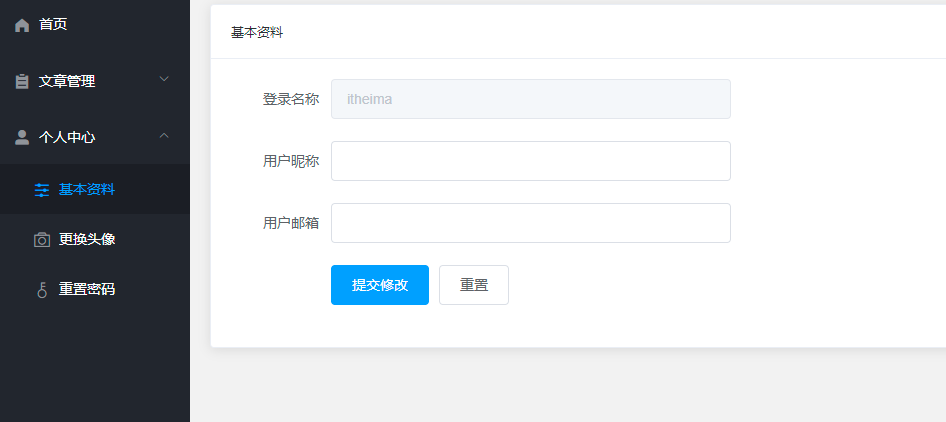
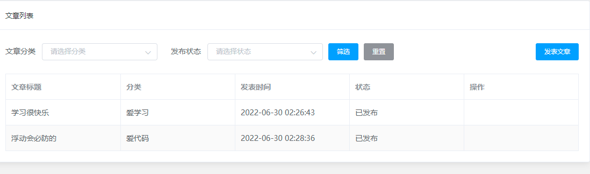
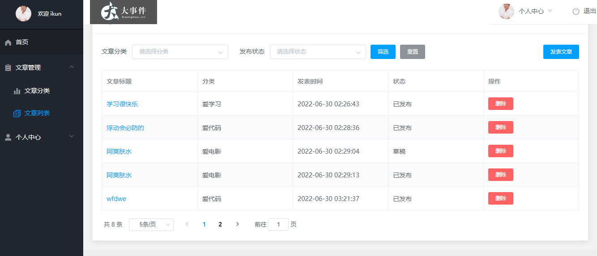
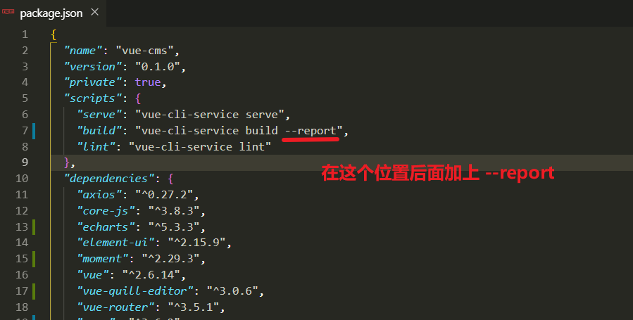

# 01-项目准备工作

项目演示地址:

​	 http://www.escook.cn:8086/ev/#/login 

* 1.接口文档: https://www.showdoc.com.cn/1425457596992351/6972620264462285

* 2.老版本基地址和在线网址
  *  在线网址：http://www.escook.cn:8086/ev/#/login 
  * 基地址：http://www.liulongbin.top:3008
* 3.新版本基地址和在线网址
  *  在线网址：http://heimazxk.gitee.io/vue-cms/
  * 基地址：http://big-event-vue-api-t.itheima.net


## 1.1-项目学习目标介绍


* 1.复习vue基础知识
  * 指令
  * 插槽、作用域插槽
  * 全家桶
    * vue-cli组件化开发
    * axios网络请求
    * vue-router路由
      * 路由跳转
      * 二级路由
    * vuex全局数据管理
      * actions异步更新数据
    * elementui布局
      * 大量深度使用各种组件
* 2.登录注册的业务实现流程
* 3.在项目中使用 vuex 管理全局共享的数据
* 4.element-ui 组件在实际开发中的应用
* 5.文件上传、富文本编辑器在 Vue 项目中的应用
* 6.复杂业务逻辑处理能力（难点）
  * dialog弹窗复用
  * 分页组件复杂逻辑
  * 筛选功能复杂逻辑


## 1.2-项目整体结构分析


## 1.3-脚手架创建项目

* 1.Manually select features（手动选择配置项,勾选router、vuex、css预处理）
    * [x] Choose Vue version
    * [x] Babel
    * [ ]  TypeScript
    * [ ]  Progressive Web App (PWA) Support
    * [x]  Router
    * [x] Vuex
    * [x] CSS Pre-processors
    * [ ] Linter / Formatter
    * [ ] Unit Testing
    * [ ] E2E Testing
* 2.Choose a version of Vue.js that you want to start the project with (Use arrow keys)
   * 选择vue版本，这里选择vue2
   * [x] 2.x
   * [ ] 3.x
* 3.Use history mode for router? (Requires proper server setup for index fallback in production) (Y/n)
   * 路由模式是否用history,这里选否。 默认用hash模式
   * [x] n
* 4.Pick a CSS pre-processor (PostCSS, Autoprefixer and CSS Modules are supported by default): (Use arrow keys)
   * [ ] 选择你的css预处理语言，这里选less
   * [ ] Sass/SCSS (with dart-sass)
   * [ ] Sass/SCSS (with node-sass)
   * [x] Less
   * [ ] Stylus
* 5.Pick a linter / formatter config: (Use arrow keys)
   * 选择你的eslint标准，这里选择默认标准
   * [ ] ESLint + Airbnb config
   * [x] ESLint + Standard config
   * [ ] ESLint + Prettier
* 6.Pick additional lint features: (Press <space> to select, <a> to toggle all, <i> to invert selection)
   * 选择你的代码检查方式，选择第一个（保存的时候检查代码）， 第二个是编译时检查
   * [x]  Lint on save
   * [ ] Lint and fix on commit
* 7.Where do you prefer placing config for Babel, ESLint, etc.? (Use arrow keys)
   * 选择要不要把 Babel, ESLint, etc单独放在一个配置文件中。（选择第一个）
   * [x] In dedicated config files
   * [ ] n package.json
* 8.Save this as a preset for future projects? (y/N)
   * 是否保存本次配置，选择否
   * [x] N


## 1.4-清理欢迎界面


* 1.vue.config.js关闭eslint

```javascript
const { defineConfig } = require('@vue/cli-service')
module.exports = defineConfig({
  transpileDependencies: true,
  //关闭eslint
  lintOnSave:false
})
```


* 2.删除默认views和components文件下的组件
* 3.删除router/index.js里面的默认路由配置

```javascript
import Vue from 'vue'
import VueRouter from 'vue-router'

Vue.use(VueRouter)

const routes = []

const router = new VueRouter({
  routes
})

export default router

```


* 4.删除App.vue中的默认代码

```html
<template>
  <div>App 根组件</div>
</template>

<script>
export default {
  name: 'App'
}
</script>

<style lang="less" scoped>

</style>

```


* 5.将课程资料中的  图片images文件夹和global.less文件 复制到 assets文件夹中
  * 在 上课视频->day01->课程资料中


## 1.5-配置element-ui与axios

* 官网参考：https://element.eleme.io/#/zh-CN/component/installation

* 1.下载element-ui与axios

  * npm i element-ui -S
  * npm i axios

* 2.main.js中配置

* ```javascript
  import Vue from 'vue'
  import App from './App.vue'
  import router from './router'
  import store from './store'
  
  Vue.config.productionTip = false
  
  
  //1.导入全局样式表
  import '@/assets/global.less'
  
  //2.导入 element-ui
  //(1)导入+注册 组件
  import ElementUI from 'element-ui'
  Vue.use(ElementUI)
  //(2)导入css样式
  import 'element-ui/lib/theme-chalk/index.css';
  
  //3.导入 axios
  import axios from 'axios'
  //挂载到Vue原型中
  Vue.prototype.$axios = axios
  //设置基地址
  axios.defaults.baseURL = 'http://big-event-vue-api-t.itheima.net'
  
  
  new Vue({
  router,
    store,
    render: h => h(App)
  }).$mount('#app')
  
  ```
  
* 


## 1.6-上传本地项目到gitee码云


* 1.新建本地仓库(默认情况下脚手架会自动帮你新建git仓库，此步骤可以省略)
  * git init
* 2.本地代码提交git
  * git add . 
  * git commit -m"初始化项目"
* 3.设置git的远程仓库地址
  * git remote add origin 你的仓库地址
* 4.提交远程仓库
  * git push -u origin "master"


> 复习git分支使用流程
>
> 1.新建分支
>
> git branch 分支名
>
> 2.切换工作分支
>
> git checkout 分支名
>
> 3.在分支上面编码
>
> 4.合并分支（合并之前先要切换到主分支）
>
> git merge 分支名


## 1.7-项目整体页面结构介绍


* `以下页面可以提前创建,也可以随着项目开发进度逐步创建`
  * views
    * Article(文章管理)
      * ArtCate.vue(文章分类页面)
      * ArtList.vue(文章列表页面)
    * Home(首页)
      * Home.vue(图表页面)
    * User(用户管理)
      * UserAvatar.vue(更换头像页面)
      * UserInfo(基本资料页面)
      * UserPwd.vue(重置密码页面)
    * Login.vue(登录页面)
    * Register.vue(注册页面)
    * Main.vue(网站首页)


# 02-登录注册页面


## 1.1-配置路由

* router/index.js

* ```javascript
  import Vue from 'vue'
  import VueRouter from 'vue-router'
  Vue.use(VueRouter)
  
  //1.导入组件
  import Register from '@/views/Register.vue'
  import Login from '@/views/Login.vue'
  
  //2.路由规则
  const routes = [
    { path: '/register', component: Register },
    { path: '/login', component: Login }
  ]
  
  //3.路由对象
  const router = new VueRouter({
    routes
  })
  
  export default router
  
  ```

* App.vue配置路由出口

  * 这里router-view直接作为App.vue的根元素（这样的话router-view的父元素就是body）
  * 如果给router-view外面包了一层div,那么这个div高度默认是0，就需要自己单独再写css（这样的话router-view就是外面的div）
    * 这两种写法都可以，只是会影响你的布局

```html
<template>
    <!-- 路由出口 -->
    <router-view></router-view>
</template>

<script>
export default {
  name: 'App'
}
</script>

<style lang="less" scoped>

</style>

```


## 1.2-注册页面


### (1)页面布局(可CV)

```html
<template>
  <!-- 注册页面的整体盒子 -->
  <div class="reg-container">
    <!-- 注册的盒子 -->
    <div class="reg-box">
      <!-- 标题的盒子 -->
      <div class="title-box"></div>
      <!-- 注册的表单区域 -->
    </div>
  </div>
</template>

<script>
export default {
  name: 'Register'
}
</script>

<style lang="less" scoped>
.reg-container {
  background: url("@/assets/images/login_bg.jpg") center;
  background-size: cover;
  height: 100%;

  .reg-box {
    width: 400px;
    height: 335px;
    background-color: #fff;
    border-radius: 3px;
    position: absolute;
    left: 50%;
    top: 50%;
    transform: translate(-50%, -50%);

    .title-box {
      height: 60px;
      background: url("@/assets/images/login_title.png") center no-repeat;
    }
  }

  .el-form {
    padding: 0 25px;
  }

  .btn-reg {
    width: 100%;
  }
}
</style>

```


### (2)使用el-form搭建表单


* el-form:https://element.eleme.cn/#/zh-CN/component/form
  * 表单组件
* el-button:https://element.eleme.cn/#/zh-CN/component/button
  * 按钮组件
* el-link:https://element.eleme.cn/#/zh-CN/component/link
  * 点击跳转登录页：`@click="$router.push('/login')"`
* el-input:https://element.eleme.cn/#/zh-CN/component/input
  * 输入框组件,可以学习给输入框插入字体图标
* el-icon:https://element.eleme.cn/#/zh-CN/component/icon
  * 字体图标组件

```html
<!-- 注册的表单区域 -->
  <el-form>
    <!-- 用户名 -->
    <el-form-item>
      <el-input placeholder="请输入用户名" prefix-icon="el-icon-user"></el-input>
    </el-form-item>
    <!-- 密码 -->
    <el-form-item>
      <el-input type="password" prefix-icon="el-icon-lock" placeholder="请输入密码"></el-input>
    </el-form-item>
    <!-- 确认密码 -->
    <el-form-item>
      <el-input type="password" prefix-icon="el-icon-lock" placeholder="请再次确认密码"></el-input>
    </el-form-item>
    <el-form-item>
      <el-button type="primary" class="btn-reg">注册</el-button>
      <el-link type="info" @click="$router.push('/login')">去登录</el-link>
    </el-form-item>
  </el-form>
```


### (3)v-model双向绑定表单数据


### (4)el-form实现表单校验

> 复习el-form表单校验三个步骤
>
> * 1.在data()中定义校验规则
> * 2.在模板上配置对应规则（三个配置）
>   * 给表单设置 `rules` 属性传入验证规则
>   * 给表单设置`model`属性传入表单数据
>   * 给表单项（Form-Item ）设置 `prop` 属性，其值为设置为需校验的字段名
> * 3.处理最终校验结果（是否每一个表单全部校验通过）


* 1.data(){}中定义校验规则

* ```javascript
  data() {
      return {
        //(1)注册表单的数据对象
        regForm: {
          username: "",
          password: "",
          repassword: ""
        },
        //(2)注册表单的验证规则对象
        regFormRules: {
          // 用户名的规则
          username: [
            { required: true, message: "用户名不能为空", trigger: "blur" },
            {
              pattern: /^[a-zA-Z0-9]{1,10}$/,
              message: "用户名必须是1-10位的字母数字",
              trigger: "blur"
            }
          ],
          // 密码规则  
          password: [
            { required: true, message: "密码不能为空", trigger: "blur" },
            {
              pattern: /^\S{6,15}$/,
              message: "密码必须是6-15位的非空字符",
              trigger: "blur"
            }
          ],
          // 确认密码规则  
          repassword: [
            { required: true, message: "请再次确认密码", trigger: "blur" },
            {
              pattern: /^\S{6,15}$/,
              message: "密码必须是6-15位的非空字符",
              trigger: "blur"
            },
            // 使用 validator 属性，来应用自定义的校验规则
            {
              validator: (rule, value, callback) => {
                // 形参中的 value 表示被绑定的元素的值
                if (value !== this.regForm.password) {
                  // 校验失败
                  callback(new Error("两次密码不一致！"));
                } else {
                  // 校验成功
                  callback();
                }
              },
              trigger: "blur"
            }
          ]
        }
      };
    },
  ```

* 2.在模板上配置对应规则

  * 给表单设置 `rules` 属性传入验证规则
  * 给表单设置`model`属性传入表单数据
  * 给表单项（Form-Item ）设置 `prop` 属性，其值为设置为需校验的字段名


* 3.处理最终校验结果

* ```javascript
  methods: {
      //点击注册按钮
      doRegister() {
        //(1)检查表单是否校验成功
        this.$refs.regFormRef.validate(valid => {
          // valid 就是表单验证的结果，如果是true，表示通过了
          console.log(valid);
          //(2)如果成功,则发送注册ajax
          if (valid) {
          }
        });
      }
    }
  ```


### (5)完成注册功能

* el-message组件:https://element.eleme.cn/#/zh-CN/component/message
  * 这个组件可以直接使用js代码展示: `this.$message.success('提示消息')`


```javascript
methods: {
    //点击注册按钮
    doRegister() {
      //1.检查表单是否校验成功
      this.$refs.regFormRef.validate(async valid => {
        // valid 就是表单验证的结果，如果是true，表示通过了
        console.log(valid);
        //2.如果成功,则发送注册ajax
        if (valid) {
          //知识点: (1)await异步函数  (2) 对象解构赋值
          const { data: res } = await this.$axios.post("/api/reg", this.regForm);
          if (res.code !== 0) {
            // 失败了
            this.$message.error(res.message);
          } else {
            // 成功了
            this.$message.success("注册成功，请登录！");
            this.$router.push("/login");
          }
        }
      });
    }
  }
```


### 完整代码

```html
<template>
  <!-- 注册页面的整体盒子 -->
  <div class="reg-container">
    <!-- 注册的盒子 -->
    <div class="reg-box">
      <!-- 标题的盒子 -->
      <div class="title-box"></div>
      <!-- 注册的表单区域 -->
      <el-form :model="regForm" :rules="regFormRules" ref="regFormRef">
        <!-- 用户名 -->
        <el-form-item prop="username">
          <el-input
            placeholder="请输入用户名"
            prefix-icon="el-icon-user"
            v-model="regForm.username"
          ></el-input>
        </el-form-item>
        <!-- 密码 -->
        <el-form-item prop="password">
          <el-input
            type="password"
            placeholder="请输入密码"
            prefix-icon="el-icon-lock"
            v-model="regForm.password"
          ></el-input>
        </el-form-item>
        <!-- 确认密码 -->
        <el-form-item prop="repassword">
          <el-input
            type="password"
            placeholder="请再次确认密码"
            prefix-icon="el-icon-lock"
            v-model="regForm.repassword"
          ></el-input>
        </el-form-item>
        <el-form-item>
          <el-button @click="doRegister" type="primary" class="btn-reg"
            >注册</el-button
          >
          <el-link @click="$router.push('/login')" type="info">去登录</el-link>
        </el-form-item>
      </el-form>
    </div>
  </div>
</template>

<script>
export default {
  name: "Register",
  data() {
    return {
      //(1)注册表单的数据对象
      regForm: {
        username: "",
        password: "",
        repassword: ""
      },
      //(2)注册表单的验证规则对象
      regFormRules: {
        // 用户名的规则
        username: [
          { required: true, message: "用户名不能为空", trigger: "blur" },
          {
            pattern: /^[a-zA-Z0-9]{1,10}$/,
            message: "用户名必须是1-10位的字母数字",
            trigger: "blur"
          }
        ],
        password: [
          { required: true, message: "密码不能为空", trigger: "blur" },
          {
            pattern: /^\S{6,15}$/,
            message: "密码必须是6-15位的非空字符",
            trigger: "blur"
          }
        ],
        repassword: [
          { required: true, message: "请再次确认密码", trigger: "blur" },
          {
            pattern: /^\S{6,15}$/,
            message: "密码必须是6-15位的非空字符",
            trigger: "blur"
          },
          // 使用 validator 属性，来应用自定义的校验规则
          {
            validator: (rule, value, callback) => {
              // 形参中的 value 表示被绑定的元素的值
              if (value !== this.regForm.password) {
                // 校验失败
                callback(new Error("两次密码不一致！"));
              } else {
                // 校验成功
                callback();
              }
            },
            trigger: "blur"
          }
        ]
      }
    };
  },
  methods: {
    //点击注册按钮
    doRegister() {
      //1.检查表单是否校验成功
      this.$refs.regFormRef.validate(async valid => {
        // valid 就是表单验证的结果，如果是true，表示通过了
        console.log(valid);
        //2.如果成功,则发送注册ajax
        if (valid) {
          //知识点: (1)await异步函数  (2) 对象解构赋值
          const { data: res } = await this.$axios.post("/api/reg", this.regForm);
          if (res.code !== 0) {
            // 失败了
            this.$message.error(res.message);
          } else {
            // 成功了
            this.$message.success("注册成功，请登录！");
            this.$router.push("/login");
          }
        }
      });
    }
  }
};
</script>

<style lang="less" scoped>
.reg-container {
  background: url("@/assets/images/login_bg.jpg") center;
  background-size: cover;
  height: 100%;

  .reg-box {
    width: 400px;
    height: 335px;
    background-color: #fff;
    border-radius: 3px;
    position: absolute;
    left: 50%;
    top: 50%;
    transform: translate(-50%, -50%);

    .title-box {
      height: 60px;
      background: url("@/assets/images/login_title.png") center no-repeat;
    }
  }

  .el-form {
    padding: 0 25px;
  }

  .btn-reg {
    width: 100%;
  }
}
</style>

```


## 1.3-登录页面


### (1)页面布局(可CV)

```html
<template>
  <!-- 登录页面的整体盒子 -->
  <div class="login-container">
    <!-- 登录的盒子 -->
    <div class="login-box">
      <!-- 标题的盒子 -->
      <div class="title-box"></div>
      <!-- 登录的表单区域 -->
    </div>
  </div>
</template>

<script>
export default {
  name: "Login",
  data() {
    return {};
  }
};
</script>

<style lang="less" scoped>
.login-container {
  background: url("@/assets/images/login_bg.jpg") center;
  background-size: cover;
  height: 100%;

  .login-box {
    width: 400px;
    height: 270px;
    background-color: #fff;
    border-radius: 3px;
    position: absolute;
    left: 50%;
    top: 50%;
    transform: translate(-50%, -50%);
    padding: 0 30px;
    box-sizing: border-box;

    .title-box {
      height: 60px;
      background: url("@/assets/images/login_title.png") center no-repeat;
    }

    .btn-login {
      width: 100%;
    }
  }
}
</style>

```


### (2)使用el-form搭建表单

```html
<!-- 登录的表单区域 -->
  <el-form>
    <!-- 用户名 -->
    <el-form-item >
      <el-input
        placeholder="请输入用户名"
        maxlength="10"
        minlength="1"
        prefix-icon="el-icon-user"
      ></el-input>
    </el-form-item>
    <!-- 密码 -->
    <el-form-item>
      <el-input
        type="password"
        placeholder="请输入密码"
        maxlength="15"
        minlength="6"
        prefix-icon="el-icon-lock"
      ></el-input>
    </el-form-item>
    <el-form-item>
      <el-button type="primary" class="btn-login"
        >登录</el-button
      >
      <el-link type="info" @click="$router.push('/register')">去注册</el-link>
    </el-form-item>
  </el-form>
```


### (3)v-model双向绑定表单数据


### (4)el-form完成表单校验


* 1.data(){}中定义校验规则

* ```javascript
  // 登录表单的验证规则对象
    loginRules: {
      username: [
        { required: true, message: '请输入用户名', trigger: 'blur' },
        { pattern: /^[a-zA-Z0-9]{1,10}$/, message: '用户名必须是1-10的字母数字', trigger: 'blur' }
      ],
      password: [
        { required: true, message: '请输入密码', trigger: 'blur' },
        { pattern: /^\S{6,15}$/, message: '密码必须是6-15的非空字符', trigger: 'blur' }
      ]
    }
  ```

* 2.在模板中配置校验规则

  * 给表单设置 `rules` 属性传入验证规则
  * 给表单设置`model`属性传入表单数据
  * 给表单项（Form-Item ）设置 `prop` 属性，其值为设置为需校验的字段名


* 小知识点：默认情况下,我们dom原生事件(例如 click,keydown等)，只能给HTML原生标签注册。 而组件是一个自定义标签，不能识别我们DOM原生事件。 如果你想给组件绑定DOM原生事件。只需要使用`native`修饰符即可
  * 事件修饰符native作用： 给自定义标签(组件)绑定事件
    * https://cn.vuejs.org/v2/guide/components-custom-events.html


### (5)完成登录功能


```javascript
methods: {
    // 点击按钮登录
    doLogin() {
      // 1. 表单校验
      this.$refs.loginRef.validate(async valid => {
        if (valid) {
          // 发起请求
          const { data: res } = await this.$axios.post("/api/login",this.loginForm)
          if( res.code == 0 ){
              // 成功
              this.$message.success(res.message)
              //跳转你首页
              this.$router.push("/")
          }else{
              this.$message.error(res.message)
          }
        }
      });
    }
  }
```


### 完整代码

```html
<template>
  <!-- 登录页面的整体盒子 -->
  <div class="login-container">
    <!-- 登录的盒子 -->
    <div class="login-box">
      <!-- 标题的盒子 -->
      <div class="title-box"></div>
      <!-- 登录的表单区域 -->
      <el-form :model="loginForm" :rules="loginRules" ref="loginRef">
        <!-- 用户名 -->
        <el-form-item prop="username">
          <el-input
            placeholder="请输入用户名"
            maxlength="10"
            minlength="1"
            v-model="loginForm.username"
          ></el-input>
        </el-form-item>
        <!-- 密码 -->
        <el-form-item prop="password">
          <el-input
            type="password"
            placeholder="请输入密码"
            maxlength="15"
            minlength="6"
            v-model="loginForm.password"
            @keydown.enter.native="doLogin"
          ></el-input>
        </el-form-item>
        <el-form-item>
          <el-button type="primary" class="btn-login" @click="doLogin"
            >登录</el-button
          >
          <el-link type="info" @click="$router.push('/register')"
            >去注册</el-link
          >
        </el-form-item>
      </el-form>
    </div>
  </div>
</template>

<script>
export default {
  name: "Login",
  data() {
    return {
      // 登录表单的数据对象
      loginForm: {
        username: "",
        password: ""
      },
      // 登录表单的验证规则对象
      loginRules: {
        username: [
          { required: true, message: "请输入用户名", trigger: "blur" },
          {
            pattern: /^[a-zA-Z0-9]{1,10}$/,
            message: "用户名必须是1-10的字母数字",
            trigger: "blur"
          }
        ],
        password: [
          { required: true, message: "请输入密码", trigger: "blur" },
          {
            pattern: /^\S{6,15}$/,
            message: "密码必须是6-15的非空字符",
            trigger: "blur"
          }
        ]
      }
    };
  },
  methods: {
    // 点击按钮登录
    doLogin() {
      // 1. 表单校验
      this.$refs.loginRef.validate(async valid => {
        if (valid) {
          // 发起请求
          const { data: res } = await this.$axios.post("/api/login",this.loginForm)
          if( res.code == 0 ){
              // 成功
              this.$message.success(res.message)
              //跳转你首页
              this.$router.push("/")
          }else{
              this.$message.error(res.message)
          }
        }
      });
    }
  }
};
</script>

<style lang="less" scoped>
.login-container {
  background: url("@/assets/images/login_bg.jpg") center;
  background-size: cover;
  height: 100%;

  .login-box {
    width: 400px;
    height: 270px;
    background-color: #fff;
    border-radius: 3px;
    position: absolute;
    left: 50%;
    top: 50%;
    transform: translate(-50%, -50%);
    padding: 0 30px;
    box-sizing: border-box;

    .title-box {
      height: 60px;
      background: url("@/assets/images/login_title.png") center no-repeat;
    }

    .btn-login {
      width: 100%;
    }
  }
}
</style>

```


# 03-首页(布局)


## 1.1-配置路由


## 1.2-使用el-container搭建页面整体结构(可CV)

* el-container:https://element.eleme.cn/#/zh-CN/component/container
  * 版心组件


```html
<template>
  <!-- 版心  -->
  <el-container>
    <!-- 1.左侧菜单栏 -->
    <el-aside width="200px">Aside</el-aside>
    <!-- 2.右侧内容 -->
    <el-container>
      <!-- 2.1 右侧顶部栏 -->
      <el-header>Header</el-header>
      <!-- 2.2 右侧内容 -->
      <el-main>Main</el-main>
      <!-- 2.3 右侧底部 -->
      <el-footer>© www.itheima.com - 黑马程序员</el-footer>
    </el-container>
  </el-container>

</template>

<script>
export default {
  name: "Main",
  data() {
    return {
    };
  }
};
</script>

<style lang="less" scoped>
.main-container {
  height: 100%;
  .el-aside {
    background-color: #23262e;
  }
  .el-header {
    padding: 0;
    display: flex;
    justify-content: space-between;
  }
  .el-main {
    overflow-y: scroll;
    height: 0;
    background-color: #f2f2f2;
  }
  .el-footer {
    background-color: #eee;
    font-size: 12px;
    display: flex;
    justify-content: center;
    align-items: center;
  }
}

.avatar {
  border-radius: 50%;
  width: 35px;
  height: 35px;
  background-color: #fff;
  margin-right: 10px;
  object-fit: cover;
}

//右侧样式
.el-header {
  .logo {
    height: 45px;
    width: 150px;
    padding: 8px 0px;
    user-select: none;
    text-align: center;
    background: url('@/assets/images/logo.png')
      center center / 100px no-repeat rgb(85, 85, 85);
    border-radius: 3px;
    margin-left: 15px;
  }
}

// 左侧边栏用户信息区域
.user-box {
  height: 70px;
  display: flex;
  justify-content: center;
  align-items: center;
  border-top: 1px solid #000;
  border-bottom: 1px solid #000;
  user-select: none;
  img {
    width: 35px;
    height: 35px;
    border-radius: 50%;
    background-color: #fff;
    margin-right: 15px;
    object-fit: cover;
  }
  span {
    color: white;
    font-size: 12px;
  }
}

// 侧边栏菜单的样式
.el-aside {
  .el-submenu,
  .el-menu-item {
    width: 200px;
    user-select: none;
  }
}
</style>
```


## 1.3-使用el-menu搭建左侧导航栏

* el-menu:https://element.eleme.cn/#/zh-CN/component/menu
  * 导航栏菜单栏组件


* el-menu
  * default-active
    * 默认选中哪一个菜单, 写el-menu-item的index属性值
  * class="el-menu-vertical-demo"
    * 默认类名，官方CV
  * background-color="#23262E"
    * 背景颜色
  * text-color="#fff"
    * 文字颜色
  * active-text-color="#409EFF"
    * 选中文本颜色
  * unique-opened
    * 是否只保持一个子菜单展开
    * 只要写了这个属性，当你点开一个子菜单的时候，另一个子菜单就会被自动折叠
  * router
    * 是否启用路由模式
    * 只要写了这个属性，那么菜单栏的index属性就会作为路由的路径跳转（相当于之前router-link的to属性）


```html
<!-- 1.左侧菜单栏 -->
<el-aside width="200px">
  <div class="user-box">
    
    <span>欢迎 </span>
  </div>
  <!-- 左侧菜单 -->
  <el-menu
    default-active="1"
    class="el-menu-vertical-demo"
    background-color="#23262E"
    text-color="#fff"
    active-text-color="#409EFF"
    unique-opened
    router
  >
    <!-- 一级菜单 -->
    <el-menu-item><i class="el-icon-s-home"></i>首页</el-menu-item>
    <!-- 一级菜单 + 二级菜单-->
    <el-submenu index="1">
      <template #title>
        <i></i>
        <span>文章管理</span>
      </template>
      <!-- 循环渲染“二级菜单” -->
      <el-menu-item index="1-1"> <i></i> 文章分类</el-menu-item>
      <el-menu-item index="1-2"> <i></i> 文章列表</el-menu-item>
    </el-submenu>
  </el-menu>
</el-aside>
```

## 1.4-搭建右侧顶部栏


* el-menu
  * mode="horizontal"
    * 垂直排列

```html
<!-- 2.1 右侧顶部栏 -->
  <el-header>
    <!-- 右侧logo -->
    <div class="logo"></div>
    <!-- 右侧菜单 -->
    <el-menu
      class="el-menu-top"
      mode="horizontal"
      text-color="#5c5c5c"
      active-text-color="#409EFF"
    >
      <el-submenu index="1">
        <template slot="title">
          <!-- 头像 -->
          
          <span>个人中心</span>
        </template>
        <el-menu-item index="1-1"
          ><i class="el-icon-s-operation"></i>基本资料</el-menu-item
        >
        <el-menu-item index="1-2"
          ><i class="el-icon-camera"></i>更换头像</el-menu-item
        >
        <el-menu-item index="1-3"
          ><i class="el-icon-key"></i>重置密码</el-menu-item
        >
      </el-submenu>
      <el-menu-item index="2"
        ><i class="el-icon-switch-button"></i>退出</el-menu-item
      >
    </el-menu>
  </el-header>
```


## 1.5-完整代码

```html
<template>
  <!-- 版心  -->
  <el-container class="main-container">
    <!-- 1.左侧菜单栏 -->
    <el-aside width="200px">
      <div class="user-box">
        
        <span>欢迎 </span>
      </div>
      <!-- 左侧菜单 -->
      <el-menu
        default-active="1"
        class="el-menu-vertical-demo"
        background-color="#23262E"
        text-color="#fff"
        active-text-color="#409EFF"
        unique-opened
        router
      >
        <!-- 一级菜单 -->
        <el-menu-item><i class="el-icon-s-home"></i>首页</el-menu-item>
        <!-- 一级菜单 + 二级菜单-->
        <el-submenu index="1">
          <template #title>
            <i></i>
            <span>文章管理</span>
          </template>
          <!-- 循环渲染“二级菜单” -->
          <el-menu-item index="1-1"> <i></i> 文章分类</el-menu-item>
          <el-menu-item index="1-2"> <i></i> 文章列表</el-menu-item>
        </el-submenu>
      </el-menu>
    </el-aside>
    <!-- 2.右侧内容 -->
    <el-container>
      <!-- 2.1 右侧顶部栏 -->
      <el-header>
        <!-- 右侧logo -->
        <div class="logo"></div>
        <!-- 右侧菜单 -->
        <el-menu
          mode="horizontal"
          text-color="#5c5c5c"
          active-text-color="#409EFF"
        >
          <el-submenu index="1">
            <template slot="title">
              <!-- 头像 -->
              
              <span>个人中心</span>
            </template>
            <el-menu-item index="1-1"
              ><i class="el-icon-s-operation"></i>基本资料</el-menu-item
            >
            <el-menu-item index="1-2"
              ><i class="el-icon-camera"></i>更换头像</el-menu-item
            >
            <el-menu-item index="1-3"
              ><i class="el-icon-key"></i>重置密码</el-menu-item
            >
          </el-submenu>
          <el-menu-item index="2"
            ><i class="el-icon-switch-button"></i>退出</el-menu-item
          >
        </el-menu>
      </el-header>
      <!-- 2.2 右侧内容 -->
      <el-main>Main</el-main>
      <!-- 2.3 右侧底部 -->
      <el-footer>© www.itheima.com - 黑马程序员</el-footer>
    </el-container>
  </el-container>
</template>

<script>
export default {
  name: "Main",
  data() {
    return {};
  }
};
</script>

<style lang="less" scoped>
.main-container {
  height: 100%;
  .el-aside {
    background-color: #23262e;
  }
  .el-header {
    padding: 0;
    display: flex;
    justify-content: space-between;
  }
  .el-main {
    overflow-y: scroll;
    height: 0;
    background-color: #f2f2f2;
  }
  .el-footer {
    background-color: #eee;
    font-size: 12px;
    display: flex;
    justify-content: center;
    align-items: center;
  }
}

.avatar {
  border-radius: 50%;
  width: 35px;
  height: 35px;
  background-color: #fff;
  margin-right: 10px;
  object-fit: cover;
}

//右侧样式
.el-header {
  .logo {
    height: 45px;
    width: 150px;
    padding: 8px 0px;
    user-select: none;
    text-align: center;
    background: url('@/assets/images/logo.png')
      center center / 100px no-repeat rgb(85, 85, 85);
    border-radius: 3px;
    margin-left: 15px;
  }
}

// 左侧边栏用户信息区域
.user-box {
  height: 70px;
  display: flex;
  justify-content: center;
  align-items: center;
  border-top: 1px solid #000;
  border-bottom: 1px solid #000;
  user-select: none;
  img {
    width: 35px;
    height: 35px;
    border-radius: 50%;
    background-color: #fff;
    margin-right: 15px;
    object-fit: cover;
  }
  span {
    color: white;
    font-size: 12px;
  }
}

// 侧边栏菜单的样式
.el-aside {
  .el-submenu,
  .el-menu-item {
    width: 200px;
    user-select: none;
  }
}
</style>

```


# 04-首页(二级路由)


## 1.1-配置二级路由

* `细节`：这个二级路由的路径不要乱写，因为我们的菜单栏是有服务器接口的。路径最好跟接口写的一致
  * 至于为什么这个菜单栏要设计成服务器接口，主要是因为这个地方设计到v-for一个特别难的不同标签渲染，到时候就知道了。（总之为了让大家学习到更加有深度的知识）


* 1.配置二级路由： router/index.js

* ```javascript
  import Vue from "vue";
  import VueRouter from "vue-router";
  Vue.use(VueRouter);
  
  //1.导入组件
  import Register from "@/views/Register.vue";
  import Login from "@/views/Login.vue";
  import Main from "@/views/Main.vue";
  //导入二级路由
  import Home from '@/views/Home/Home.vue'
  import UserInfo from '@/views/User/UserInfo.vue'
  import UserAvatar from '@/views/User/UserAvatar.vue'
  import UserPwd from '@/views/User/UserPwd.vue'
  import ArtCate from '@/views/Article/ArtCate.vue'
  import ArtList from '@/views/Article/ArtList.vue'
  
  //2.路由规则
  const routes = [
    { path: "/register", component: Register },
    { path: "/login", component: Login },
    { path: "/", component: Main,children:[
      //二级路由配置
      { path: '/', component: Home },
      { path: '/home', component: Home },
      { path: '/user-info', component: UserInfo },
      { path: '/user-avatar', component: UserAvatar },
      { path: '/user-pwd', component: UserPwd },
      { path: '/art-cate', component: ArtCate },
      { path: '/art-list', component: ArtList }
    ] }
  ];
  
  //3.路由对象
  const router = new VueRouter({
    routes
  });
  
  export default router;
  
  ```


## 1.2-添加二级路由出口


* 2.添加二级路由出口  Main.vue


* 3.最终成品效果


# 05-项目token处理(vuex+axios拦截器)


## 1.1-使用vuex存储token

* store/index.js

```javascript
import Vue from 'vue'
import Vuex from 'vuex'

Vue.use(Vuex)

export default new Vuex.Store({
  //1.state:存储数据
  state: {
    // 登录成功之后的 token 值
    token: '',
  },
  //2.mutations:更新数据
  mutations: {
    //更新 token
    updateToken(state, newToken) {
      state.token = newToken
    },
  },
  //3.actions: 异步更新数据
  actions: {
    
  },
  //4.modules：模块化state中的数据  
  modules: {
  }
})
```


## 1.2-登录成功之后将数据存入vuex

* Login.vue


## 1.3-使用vuex的插件持久化vuex数据

> 默认情况下： vuex中的数据是存储在内存中的，只要页面一刷新就会消失
>
> 如果希望将vuex中的数据存入硬盘持久化，就需要使用vuex的插件：vuex-persistedstate
>
> 底层原理：自动将vuex中的数据用localStorage存入硬盘中


* 1.下载插件

  * npm install --save vuex-persistedstate@3.2.1

* 2.在vuex中配置插件

* 

* ```javascript
  import Vue from 'vue'
  import Vuex from 'vuex'
  // 导入持久化插件
  import creteState from 'vuex-persistedstate'
  
  Vue.use(Vuex)
  
  export default new Vuex.Store({
    //配置持久化存储数据的 vuex 插件
    plugins: [creteState()],
    //1.state:存储数据
    state: {
      // 登录成功之后的 token 值
      token: '',
    },
    //2.mutations:更新数据
    mutations: {
      //更新 token
      updateToken(state, newToken) {
        state.token = newToken
      },
    },
    //3.actions: 异步更新数据
    actions: {
    },
    modules: {
    }
  })
  
  ```


## 1.4-使用vuex的actions存储用户信息

> 什么时候用vuex的actions : 当需要存储在vuex的数据需要异步获取
>
> actions使用四个流程
>
> （1）组件给actions发送消息：  this.$store.dispatch('actions名',载荷)
>
>    (2)   actions发送异步请求
>
> （3）actions提交mutations更新
>
> （4）mutations更新state数据


* store/index.js

```javascript
import Vue from "vue";
import Vuex from "vuex";
// 导入持久化插件
import creteState from "vuex-persistedstate";
//导入axios
import axios from 'axios'

Vue.use(Vuex);

export default new Vuex.Store({
  //配置持久化存储数据的 vuex 插件
  plugins: [creteState()],
  //1.state:存储数据
  state: {
    // 登录成功之后的 token 值
    token: "",
    // 用户的基本信息
    userInfo: {}
  },
  //2.mutations:更新数据
  mutations: {
    //更新 token
    updateToken(state, newToken) {
      state.token = newToken;
    },
    // 更新用户基本信息
    updateUserInfo(state, obj) {
      state.userInfo = obj;
    }
  },
  //3.actions: 异步更新数据
  actions: {
    //context:当前的vuex实例对象store
    async initUserInfo(context) {
      const { data: res } = await axios.get("/my/userinfo");
      console.log(res)
      // 获取成功，调用mutations更新数据
      if (res.code === 0) {
        context.commit("updateUserInfo", res.data);
      }
    }
  },
  modules: {}
});

```


* 登录成功之后，请求个人信息

* Main.vue的created钩子中

* ```javascript
  //提交actions:异步请求用户信息
  this.$store.dispatch('initUserInfo')
  ```

* 


## 1.5-使用axios拦截器发送token

> axios拦截器作用： 在发送请求之前和响应数据之后拦截axios
>
> 应用场景
>     发送请求之前:   给服务器发token
>
> ​    响应数据之后：判断401错误，自动跳转登录页


* main.js中配置axios拦截器
  * 细节：因为main.js中已经导入了router和store,所以在main.js中访问路由和vuex直接访问即可
    * (1)如果是在组件.vue文件中访问: ` this.$router`  和  `this.$store` 和 `this.$axios`
    * (2)如果是在js文件中访问 :  `先使用es6模块化语法导入,然后才能使用`
      * 你导入的是什么对象,就用什么对象
  * 字符串的startsWith是js原生的方法，作用是判断字符串是否以某个字符串开头

```javascript
import Vue from "vue";
import App from "./App.vue";
import router from "./router";
import store from "./store";

Vue.config.productionTip = false;

//1.导入全局样式表
import "@/assets/global.less";

//2.导入 element-ui
//(1)导入+注册 组件
import ElementUI from "element-ui";
Vue.use(ElementUI);
//(2)导入css样式
import "element-ui/lib/theme-chalk/index.css";

//3.导入 axios
import axios from "axios";
//挂载到Vue原型中
Vue.prototype.$axios = axios;
//设置基地址
axios.defaults.baseURL = "http://big-event-vue-api-t.itheima.net";

// 添加请求拦截器
axios.interceptors.request.use(
  function(config) {
    //请求发送之前做点什么
    // 判断本次请求是否以 /my 开头，决定是否添加身份认证的字段
    if (config.url.startsWith("/my") && store.state.token) {
      config.headers.Authorization = store.state.token
    }
    return config;
  },
  function(error) {
    //请求错误做点什么
    return Promise.reject(error);
  }
);

// 响应拦截器
axios.interceptors.response.use(
  function(response) {
    // 响应成功之后做点什么
    return response;
  },
  function(error) {
    // 响应失败之后做点什么
    //判断是不是token无效导致
    if (error.response.status === 401) {
      // 1. 立即清空无效的 token
      store.commit("updateToken", "");
      // 2. 跳转到登录页面
      alert('请先登录')
      router.push("/login");
    }
    return Promise.reject(error);
  }
);

new Vue({
  router,
  store,
  render: h => h(App)
}).$mount("#app");

```


## 1.6-退出登录

* el-messageBox弹窗：https://element.eleme.cn/#/zh-CN/component/message-box
  * 这个组件可以直接使用js代码展示: `this.$confirm().then()`


* Main.vue

  * 绑定退出登录事件

    * ```html
      <el-menu-item index="2" @click="logout">
          <i class="el-icon-switch-button"></i>退出
      </el-menu-item>
      ```

    * 

  * 完成退出登录功能

    * `细节`：这里catch可以省略, 写上了点取消浏览器不爆红。 不写的话点取消浏览器爆红。（没啥区间，看你自己强迫症程度了）

    * ```javascript
      logout() {
        this.$confirm("您确认退出登录吗？", "提示", {
          confirmButtonText: "确定",
          cancelButtonText: "取消",
          type: "warning"
        }).then(() => {
          // 1. 清空 token
          this.$store.commit("updateToken", "");
          // 2. 跳转到登录页面
          this.$router.push("/login");
        }).catch(()=>{})
      }
      ```


# 06-首页(渲染左侧菜单栏)


## 1.1-发送ajax请求左侧菜单栏


* Main.vue

* ```javascript
  <script>
  export default {
    name: "Main",
    data() {
      return {
        menus:[]
      };
    },
    async created() {
      //提交actions:异步请求用户信息
      this.$store.dispatch("initUserInfo")
      //发送ajax请求菜单栏
      const { data: res } = await this.$axios.get('/my/menus')
      console.log(res)
      //成功之后绑定到data
      if( res.code == 0 ){
        this.menus = res.data
      }else{
        this.$message.error('获取菜单失败！')
      }
    },
    methods: {
      logout() {
        this.$confirm("您确认退出登录吗？", "提示", {
          confirmButtonText: "确定",
          cancelButtonText: "取消",
          type: "warning"
        }).then(() => {
            // 1. 清空 token
            this.$store.commit("updateToken", "");
            // 2. 跳转到登录页面
            this.$router.push("/login");
          })
      }
    }
  };
  </script>
  ```

  

## 1.2-渲染用户个人信息


* 1.给Main.vue添加一个计算属性，用于简化vuex代码

* ```javascript
   computed:{
      userInfo(){
        return this.$store.state.userInfo
      }
    },
  ```

* 左侧菜单栏 + 右侧个人信息


## 1.3-渲染左侧菜单栏


* 难点分析

  * (1)如果el-menu没有二级菜单就是el-menu-item
  * (2)如果el-menu有二级菜单就是el-submenu
  * (3)服务器返回的数组, 有一个children属性。 如果这个属性为空，就代表没有二级菜单。如果是一个数组就代表有二级菜单。

* 思路分析

  * (1)也就说,这个数组在使用v-for指令的时候。无法确定到底要生成哪一个标签。需要根据数组的元素来判断。
  * (2)解决方案：使用<template>包裹,根据条件来判断到底要渲染哪一个元素

  

* `举一反三`：只要v-for指令渲染的标签是`不固定的`，就可以使用<template>进行包裹后渲染


* 核心结构如下

  * ```html
    <template v-for="">
        <!-- 下面两个组件二选一渲染 -->
        <组件a v-if="条件"></组件a>
        <组件b v-else></组件b>
    </template>
    ```

  * 逻辑类似于js中的这种逻辑

    * 其实就是一个v-for嵌套一个v-if  v-else

  * ```javascript
    for(let i = 1;i<=10;i++){
        if( i % 2 == 0){
            console.log('我要生成el-menu-item')
        }else{
            console.log('我要生成el-submenu')
        }
    }
    ```

  * 


* Main.vue左侧菜单栏
  * default-active="/home"
    * 设置菜单栏默认/home对应的页面高亮

```html
<!-- 左侧菜单 -->
  <el-menu
    default-active="/home"
    class="el-menu-vertical-demo"
    background-color="#23262E"
    text-color="#fff"
    active-text-color="#409EFF"
    unique-opened
    router
  >
    <!-- (1) template 只起到包裹的作用，不会被渲染为任何元素 
         (2) key 只能绑定给真实的 DOM 元素，无法绑定给 template 标签
    -->
    <template v-for="item in menus">
      <!-- 1.如果children为空则渲染el-menu-item -->
      <el-menu-item
        :index="item.indexPath"
        :key="item.indexPath"
        v-if="!item.children"
        ><i :class="item.icon"></i>{{ item.title }}</el-menu-item
      >
      <!-- 2.如果children不为空则渲染el-sunmenu -->
      <el-submenu :index="item.indexPath" :key="item.indexPath" v-else>
        <!-- 一级标题 -->
        <template #title>
          <i :class="item.icon"></i>
          <span>{{ item.title }}</span>
        </template>
        <!-- 继续使用v-for渲染children生成多个二级菜单 -->
        <el-menu-item
          :index="subItem.indexPath"
          v-for="subItem in item.children"
          :key="subItem.indexPath"
        >
          <i :class="subItem.icon"></i>{{ subItem.title }}</el-menu-item
        >
      </el-submenu>
    </template>
  </el-menu>
```


# 07-首页图表(课后自行完成)


* 样式不一定非要一模一样哈，目的是复习echarts绘制图表一些配置

  

> 1.本项目首页图表没有服务器接口，因此只需要渲染本地数据即可
>
> 2.由于之前的课程已经深度学习了echarts图表制作，因此本项目的图标作为课后作业，由学生自主完成
>
> 原因： `大事件项目图表比之前CMS项目的图表要更加简单`


* 1.echarts官网：https://echarts.apache.org/zh/index.html
* 2.下载echarts
  * npm i echarts
* 3.导入echarts :https://echarts.apache.org/handbook/zh/basics/import/
  * import * as echarts from 'echarts'


* 整体布局使用的是element-ui的layout布局：https://element.eleme.cn/#/zh-CN/component/layout

* 本案例所需要数据如下 （渲染的时候因为有dom操作，所以要在mounted钩子中进行哟）

  * 折线图

    * ```javascript
      let aListAll = [
        { count: 36, date: '2019-04-13' },
        { count: 52, date: '2019-04-14' },
        { count: 78, date: '2019-04-15' },
        { count: 85, date: '2019-04-16' },
        { count: 65, date: '2019-04-17' },
        { count: 72, date: '2019-04-18' },
        { count: 88, date: '2019-04-19' },
        { count: 64, date: '2019-04-20' },
        { count: 72, date: '2019-04-21' },
        { count: 90, date: '2019-04-22' },
        { count: 96, date: '2019-04-23' },
        { count: 100, date: '2019-04-24' },
        { count: 102, date: '2019-04-25' },
        { count: 110, date: '2019-04-26' },
        { count: 123, date: '2019-04-27' },
        { count: 100, date: '2019-04-28' },
        { count: 132, date: '2019-04-29' },
        { count: 146, date: '2019-04-30' },
        { count: 200, date: '2019-05-01' },
        { count: 180, date: '2019-05-02' },
        { count: 163, date: '2019-05-03' },
        { count: 110, date: '2019-05-04' },
        { count: 80, date: '2019-05-05' },
        { count: 82, date: '2019-05-06' },
        { count: 70, date: '2019-05-07' },
        { count: 65, date: '2019-05-08' },
        { count: 54, date: '2019-05-09' },
        { count: 40, date: '2019-05-10' },
        { count: 45, date: '2019-05-11' },
        { count: 38, date: '2019-05-12' }
      ]
      ```

    * 其他图表数据可以随便写（主要是练习echarts布局的）

      

## 1.1-整体布局(可CV)

```html
<template>
  <div>
    <div class="container-fluid">
      <el-row class="spannel_list" :gutter="10">
        <el-col :sm="6" :xs="12">
          <div class="spannel">
            <em>10015</em><span>篇</span>
            <b>总文章数</b>
          </div>
        </el-col>
        <el-col :sm="6" :xs="12">
          <div class="spannel scolor01">
            <em>123</em><span>篇</span>
            <b>日新增文章数</b>
          </div>
        </el-col>
        <el-col :sm="6" :xs="12">
          <div class="spannel scolor02">
            <em>35</em><span>条</span>
            <b>评论总数</b>
          </div>
        </el-col>
        <el-col :sm="6" :xs="12">
          <div class="spannel scolor03">
            <em>123</em><span>条</span>
            <b>日新增评论数</b>
          </div>
        </el-col>
      </el-row>
    </div>

    <div class="container-fluid">
      <el-row class="curve-pie" :gutter="10">
        <el-col :sm="16" :xs="16">
          <div class="gragh_pannel" id="curve_show"></div>
        </el-col>
        <el-col :sm="8" :xs="8">
          <div class="gragh_pannel" id="pie_show"></div>
        </el-col>
      </el-row>
    </div>

    <div class="container-fluid">
      <div class="column_pannel" id="column_show"></div>
    </div>
  </div>
</template>

<script>
import * as echarts from 'echarts'

export default {
  name: 'Home',
}
</script>

<style lang="less" scoped>
.spannel_list {
  margin-top: 20px;
}

.spannel {
  height: 100px;
  overflow: hidden;
  text-align: center;
  position: relative;
  background-color: #fff;
  border: 1px solid #e7e7e9;
  margin-bottom: 20px;
}

.spannel em {
  font-style: normal;
  font-size: 50px;
  line-height: 50px;
  display: inline-block;
  margin: 10px 0 0 20px;
  font-family: 'Arial';
  color: #83a2ed;
}

.spannel span {
  font-size: 14px;
  display: inline-block;
  color: #83a2ed;
  margin-left: 10px;
}

.spannel b {
  position: absolute;
  left: 0;
  bottom: 0;
  width: 100%;
  line-height: 24px;
  background: #e5e5e5;
  color: #333;
  font-size: 14px;
  font-weight: normal;
}

.scolor01 em,
.scolor01 span {
  color: #6ac6e2;
}

.scolor02 em,
.scolor02 span {
  color: #5fd9de;
}

.scolor03 em,
.scolor03 span {
  color: #58d88e;
}

.gragh_pannel {
  height: 350px;
  border: 1px solid #e7e7e9;
  background-color: #fff !important;
  margin-bottom: 20px;
}

.column_pannel {
  margin-bottom: 20px;
  height: 400px;
  border: 1px solid #e7e7e9;
  background-color: #fff !important;
}
</style>

```


## 1.2-完整代码

```html
<template>
  <div>
    <div class="container-fluid">
      <el-row class="spannel_list" :gutter="10">
        <el-col :sm="6" :xs="12">
          <div class="spannel">
            <em>10015</em><span>篇</span>
            <b>总文章数</b>
          </div>
        </el-col>
        <el-col :sm="6" :xs="12">
          <div class="spannel scolor01">
            <em>123</em><span>篇</span>
            <b>日新增文章数</b>
          </div>
        </el-col>
        <el-col :sm="6" :xs="12">
          <div class="spannel scolor02">
            <em>35</em><span>条</span>
            <b>评论总数</b>
          </div>
        </el-col>
        <el-col :sm="6" :xs="12">
          <div class="spannel scolor03">
            <em>123</em><span>条</span>
            <b>日新增评论数</b>
          </div>
        </el-col>
      </el-row>
    </div>

    <div class="container-fluid">
      <el-row class="curve-pie" :gutter="10">
        <el-col :sm="16" :xs="16">
          <div class="gragh_pannel" id="curve_show"></div>
        </el-col>
        <el-col :sm="8" :xs="8">
          <div class="gragh_pannel" id="pie_show"></div>
        </el-col>
      </el-row>
    </div>

    <div class="container-fluid">
      <div class="column_pannel" id="column_show"></div>
    </div>
  </div>
</template>

<script>
import * as echarts from 'echarts'

export default {
  name: 'Home',
  mounted() {
    let oChart = echarts.init(document.getElementById('curve_show'))
    let aListAll = [
      { count: 36, date: '2019-04-13' },
      { count: 52, date: '2019-04-14' },
      { count: 78, date: '2019-04-15' },
      { count: 85, date: '2019-04-16' },
      { count: 65, date: '2019-04-17' },
      { count: 72, date: '2019-04-18' },
      { count: 88, date: '2019-04-19' },
      { count: 64, date: '2019-04-20' },
      { count: 72, date: '2019-04-21' },
      { count: 90, date: '2019-04-22' },
      { count: 96, date: '2019-04-23' },
      { count: 100, date: '2019-04-24' },
      { count: 102, date: '2019-04-25' },
      { count: 110, date: '2019-04-26' },
      { count: 123, date: '2019-04-27' },
      { count: 100, date: '2019-04-28' },
      { count: 132, date: '2019-04-29' },
      { count: 146, date: '2019-04-30' },
      { count: 200, date: '2019-05-01' },
      { count: 180, date: '2019-05-02' },
      { count: 163, date: '2019-05-03' },
      { count: 110, date: '2019-05-04' },
      { count: 80, date: '2019-05-05' },
      { count: 82, date: '2019-05-06' },
      { count: 70, date: '2019-05-07' },
      { count: 65, date: '2019-05-08' },
      { count: 54, date: '2019-05-09' },
      { count: 40, date: '2019-05-10' },
      { count: 45, date: '2019-05-11' },
      { count: 38, date: '2019-05-12' }
    ]

    const aCount = []
    const aDate = []

    for (let i = 0; i < aListAll.length; i++) {
      aCount.push(aListAll[i].count)
      aDate.push(aListAll[i].date)
    }

    let chartopt = {
      title: {
        text: '月新增文章数',
        left: 'center',
        top: '10'
      },
      tooltip: {
        trigger: 'axis'
      },
      legend: {
        data: ['新增文章'],
        top: '40'
      },
      toolbox: {
        show: true,
        feature: {
          mark: { show: true },
          dataView: { show: true, readOnly: false },
          magicType: { show: true, type: ['line', 'bar'] },
          restore: { show: true },
          saveAsImage: { show: true }
        }
      },
      calculable: true,
      xAxis: [
        {
          name: '日',
          type: 'category',
          boundaryGap: false,
          data: aDate
        }
      ],
      yAxis: [
        {
          name: '月新增文章数',
          type: 'value'
        }
      ],
      series: [
        {
          name: '新增文章',
          type: 'line',
          smooth: true,
          areaStyle: { type: 'default' },
          itemStyle: { color: '#f80', lineStyle: { color: '#f80' } },
          data: aCount
        }
      ],
      areaStyle: {
        normal: {
          color: new echarts.graphic.LinearGradient(0, 0, 0, 1, [
            {
              offset: 0,
              color: 'rgba(255,136,0,0.39)'
            },
            {
              offset: 0.34,
              color: 'rgba(255,180,0,0.25)'
            },
            {
              offset: 1,
              color: 'rgba(255,222,0,0.00)'
            }
          ])
        }
      },
      grid: {
        show: true,
        x: 50,
        x2: 50,
        y: 80,
        height: 220
      }
    }

    oChart.setOption(chartopt)

    let oPie = echarts.init(document.getElementById('pie_show'))
    let oPieopt = {
      title: {
        top: 10,
        text: '分类文章数量比',
        x: 'center'
      },
      tooltip: {
        trigger: 'item',
        formatter: '{a} <br/>{b} : {c} ({d}%)'
      },
      color: ['#5885e8', '#13cfd5', '#00ce68', '#ff9565'],
      legend: {
        x: 'center',
        top: 65,
        data: ['奇趣事', '会生活', '爱旅行', '趣美味']
      },
      toolbox: {
        show: true,
        x: 'center',
        top: 35,
        feature: {
          mark: { show: true },
          dataView: { show: true, readOnly: false },
          magicType: {
            show: true,
            type: ['pie', 'funnel'],
            option: {
              funnel: {
                x: '25%',
                width: '50%',
                funnelAlign: 'left',
                max: 1548
              }
            }
          },
          restore: { show: true },
          saveAsImage: { show: true }
        }
      },
      calculable: true,
      series: [
        {
          name: '访问来源',
          type: 'pie',
          radius: ['45%', '60%'],
          center: ['50%', '65%'],
          data: [
            { value: 300, name: '奇趣事' },
            { value: 100, name: '会生活' },
            { value: 260, name: '爱旅行' },
            { value: 180, name: '趣美味' }
          ]
        }
      ]
    }
    oPie.setOption(oPieopt)

    let oColumn = echarts.init(document.getElementById('column_show'))
    let oColumnopt = {
      title: {
        text: '文章访问量',
        left: 'center',
        top: '10'
      },
      tooltip: {
        trigger: 'axis'
      },
      legend: {
        data: ['奇趣事', '会生活', '爱旅行', '趣美味'],
        top: '40'
      },
      toolbox: {
        show: true,
        feature: {
          mark: { show: true },
          dataView: { show: true, readOnly: false },
          magicType: { show: true, type: ['line', 'bar'] },
          restore: { show: true },
          saveAsImage: { show: true }
        }
      },
      calculable: true,
      xAxis: [
        {
          type: 'category',
          data: ['1月', '2月', '3月', '4月', '5月']
        }
      ],
      yAxis: [
        {
          name: '访问量',
          type: 'value'
        }
      ],
      series: [
        {
          name: '奇趣事',
          type: 'bar',
          barWidth: 20,
          areaStyle: { type: 'default' },
          itemStyle: {
            color: '#fd956a'
          },
          data: [800, 708, 920, 1090, 1200]
        },
        {
          name: '会生活',
          type: 'bar',
          barWidth: 20,
          areaStyle: { type: 'default' },
          itemStyle: {
            color: '#2bb6db'
          },
          data: [400, 468, 520, 690, 800]
        },
        {
          name: '爱旅行',
          type: 'bar',
          barWidth: 20,
          areaStyle: { type: 'default' },
          itemStyle: {
            color: '#13cfd5'
          },
          data: [500, 668, 520, 790, 900]
        },
        {
          name: '趣美味',
          type: 'bar',
          barWidth: 20,
          areaStyle: { type: 'default' },
          itemStyle: {
            color: '#00ce68'
          },
          data: [600, 508, 720, 890, 1000]
        }
      ],
      grid: {
        show: true,
        x: 50,
        x2: 30,
        y: 80,
        height: 260
      },
      dataZoom: [
        // 给x轴设置滚动条
        {
          start: 0, // 默认为0
          end: 100 - 1000 / 31, // 默认为100
          type: 'slider',
          show: true,
          xAxisIndex: [0],
          handleSize: 0, // 滑动条的 左右2个滑动条的大小
          height: 8, // 组件高度
          left: 45, // 左边的距离
          right: 50, // 右边的距离
          bottom: 26, // 右边的距离
          handleColor: '#ddd', // h滑动图标的颜色
          handleStyle: {
            borderColor: '#cacaca',
            borderWidth: '1',
            shadowBlur: 2,
            background: '#ddd',
            shadowColor: '#ddd'
          }
        }
      ]
    }
    oColumn.setOption(oColumnopt)
  }
}
</script>

<style lang="less" scoped>
.spannel_list {
  margin-top: 20px;
}

.spannel {
  height: 100px;
  overflow: hidden;
  text-align: center;
  position: relative;
  background-color: #fff;
  border: 1px solid #e7e7e9;
  margin-bottom: 20px;
}

.spannel em {
  font-style: normal;
  font-size: 50px;
  line-height: 50px;
  display: inline-block;
  margin: 10px 0 0 20px;
  font-family: 'Arial';
  color: #83a2ed;
}

.spannel span {
  font-size: 14px;
  display: inline-block;
  color: #83a2ed;
  margin-left: 10px;
}

.spannel b {
  position: absolute;
  left: 0;
  bottom: 0;
  width: 100%;
  line-height: 24px;
  background: #e5e5e5;
  color: #333;
  font-size: 14px;
  font-weight: normal;
}

.scolor01 em,
.scolor01 span {
  color: #6ac6e2;
}

.scolor02 em,
.scolor02 span {
  color: #5fd9de;
}

.scolor03 em,
.scolor03 span {
  color: #58d88e;
}

.gragh_pannel {
  height: 350px;
  border: 1px solid #e7e7e9;
  background-color: #fff !important;
  margin-bottom: 20px;
}

.column_pannel {
  margin-bottom: 20px;
  height: 400px;
  border: 1px solid #e7e7e9;
  background-color: #fff !important;
}
</style>

```


# 08-个人中心

## 1.1-基本资料





### (1)页面布局（可CV）


```html
<template>
  <el-card class="box-card">
    <div slot="header" class="clearfix">
      <span>基本资料</span>
    </div>
    <!-- 表单 -->
  </el-card>
</template>

<script>
export default {
  name: 'UserInfo'
}
</script>

<style lang="less" scoped>
.el-form {
  width: 500px;
}
</style>

```


### (2)el-form搭建表单


```html
<!-- 表单 -->
<el-form label-width="100px">
  <el-form-item label="登录名称" >
    <el-input  disabled></el-input>
  </el-form-item>
  <el-form-item label="用户昵称" >
    <el-input  minlength="1" maxlength="10"></el-input>
  </el-form-item>
  <el-form-item label="用户邮箱" >
    <el-input ></el-input>
  </el-form-item>
  <el-form-item>
    <el-button type="primary">提交修改</el-button>
    <el-button>重置</el-button>
  </el-form-item>
</el-form>
```


### (3)v-model双向绑定表单数据


* user : this.$store.state.userInfo

  * 这种写法是拷贝 vuex中userInfo的地址, 那么一旦修改user的数据, 本质还是修改vuex的数据。（而vuex中的数据是不允许在组件中直接修改的）
    * `本质是拷贝地址`

* user : { ...this.$store.state.userInfo }

  * 这种写法并没有拷贝vuex中userInfo的地址， 而是单独声明一个空对象， 然后把vuex中的数据给拷贝进去。相当于下面这种写法.

    * `本质是拷贝数据,没有拷贝地址`

    * ```javascript
      user = {
          username : this.$store.state.userInfo.username,
          nickname : this.$store.state.userInfo.nickname,
          email : this.$store.state.userInfo.email,
      }
      ```

      


### (4)el-form实现表单校验


* 1.data(){}中定义校验规则

* ```javascript
  // 表单的验证规则对象
    userRules: {
      nickname: [
        { required: true, message: '请输入用户昵称', trigger: 'blur' },
        { pattern: /^\S{1,10}$/, message: '昵称必须是1-10位的非空字符串', trigger: 'blur' }
      ],
      email: [
        { required: true, message: '请输入用户邮箱', trigger: 'blur' },
        { type: 'email', message: '邮箱格式不正确', trigger: 'blur' }
      ]
    }
  ```

* 2.在模板中配置校验规则

  * 给表单设置 `rules` 属性传入验证规则
  * 给表单设置`model`属性传入表单数据
  * 给表单项（Form-Item ）设置 `prop` 属性，其值为设置为需校验的字段名


### (5)完成修改基本资料


```javascript
methods: {
    async doSubmit() {
      // 1. 验证表单是否全部校验通过
      this.$refs.userFormRef.validate(async valid => {
        if( valid ){
          // 2. 验证通过，发起请求
          const { data: res } = await this.$axios.put("/my/userinfo",this.user)

          if( res.code === 0 ){
            //弹窗提示
            this.$message.success("更新用户信息成功！")
            //提交vuex的actions更新用户信息
            this.$store.dispatch("initUserInfo")
          }else{
            this.$message.error("更新用户信息失败！")
          }
        }
      })
    }
  }
```


### 完整代码

```html
<template>
  <el-card class="box-card">
    <div slot="header" class="clearfix">
      <span>基本资料</span>
    </div>
    <!-- 表单 -->
    <el-form
      label-width="100px"
      :model="user"
      :rules="userRules"
      ref="userFormRef"
    >
      <el-form-item label="登录名称">
        <el-input disabled v-model="user.username"></el-input>
      </el-form-item>
      <el-form-item label="用户昵称" prop="nickname">
        <el-input
          minlength="1"
          maxlength="10"
          v-model="user.nickname"
        ></el-input>
      </el-form-item>
      <el-form-item label="用户邮箱" prop="email">
        <el-input v-model="user.email"></el-input>
      </el-form-item>
      <el-form-item>
        <el-button type="primary" @click="doSubmit">提交修改</el-button>
        <el-button @click="$refs.userFormRef.resetFields()">重置</el-button>
      </el-form-item>
    </el-form>
  </el-card>
</template>

<script>
export default {
  name: "UserInfo",
  data() {
    return {
      user: { ...this.$store.state.userInfo },
      //表单验证规则
      userRules: {
        nickname: [
          { required: true, message: "请输入用户昵称", trigger: "blur" },
          {
            pattern: /^\S{1,10}$/,
            message: "昵称必须是1-10位的非空字符串",
            trigger: "blur"
          }
        ],
        email: [
          { required: true, message: "请输入用户邮箱", trigger: "blur" },
          { type: "email", message: "邮箱格式不正确", trigger: "blur" }
        ]
      }
    };
  },
  methods: {
    async doSubmit() {
      // 1. 验证表单的合法性
      this.$refs.userFormRef.validate(async valid => {
        if( valid ){
          // 2. 验证通过，发起请求
          const { data: res } = await this.$axios.put("/my/userinfo",this.user)

          if( res.code === 0 ){
            //弹窗提示
            this.$message.success("更新用户信息成功！")
            //提交vuex的actions更新用户信息
            this.$store.dispatch("initUserInfo")
          }else{
            this.$message.error("更新用户信息失败！")
          }
        }
      })
    }
  }
}
</script>

<style lang="less" scoped>
.el-form {
  width: 500px;
}
</style>

```


## 1.2-更换头像


> 本案例技术点有以下几个

* 1.el-card : 卡片组件  https://element.eleme.cn/#/zh-CN/component/card
* 2.服务器接口文档比较特殊，给服务器发送的不是图片二进制数据，而是一个base64字符串。
  * 2.1 如果接口文档要求图片上传二进制数据  (之前学习过的)
    * (1)文件预览思路：将图片转成url  
      * `URL.createObjectURL(文件对象)`
    * (2)文件上传思路：使用FormData
      * 这个对象会自动处理文件二进制，并且修改请求头为文件请求头
      * `const fd = new FormData()`
      * `fd.append('图片接口参数',文件对象)`
  * 2.2 如果接口文档要求图片上传base64字符串
    * (1)文件预览思路：使用 fileReader对象读取文件生成base64字符串
      * https://developer.mozilla.org/zh-CN/docs/Web/API/FileReader
    * (2)文件上传思路：不需要额外处理, 就把文件当做字符串提交即可
      * 前提是要把文件转成base64格式字符串


### (1)页面布局(可CV)


* 自定义上传按钮思路
  * （1）给file表单绑定一个onchange事件,并且默认display为none
  *    (2)  添加自定义上传按钮，点击按钮调用file表单的click事件
    * 这个是dom原生自带的功能，因此要给file表单绑定一个ref
    * 点击按钮就相当于点击了file表单

```html
<template>
  <!-- 卡片盒子 -->
  <el-card class="box-card">
    <!-- 1.头部插槽 -->
    <div slot="header" class="clearfix">
      <span>更换头像</span>
    </div>
    <!-- 2.内容盒子 -->
    <div>
      <!-- 图片，用来展示用户选择的头像 -->
      

      <!-- 按钮区域 -->
      <div class="btn-box">
        <!-- 渲染一个被隐藏的文件选择框，只允许选中图片文件 -->
        <input type="file" style="display: none" accept="image/*" ref="iptRef" @change="onFileChange" />
        <el-button type="primary" icon="el-icon-plus" @click="$refs.iptRef.click()">选择图片</el-button>
        <el-button type="success" icon="el-icon-upload" @click="uploadAvatar">上传头像
        </el-button>
      </div>
    </div>
  </el-card>
</template>

<script>
export default {
  name: "UserAvatar",
  data() {
    return {
      //用户头像  base64字符串
      avatar: ''
    }
  },
  methods: {
    //1.头像预览
    onFileChange(e) {
      
    },
    //2.头像提交
    uploadAvatar(){

    }
  }
};
</script>

<style lang="less" scoped>
.btn-box {
  margin-top: 10px;
}
.preview {
  object-fit: cover;
  width: 350px;
  height: 350px;
}
</style>

```


### (2)给data添加avatar绑定图片base64字符串


### (3)使用fileReader实现文件预览

* 核心步骤
  * 1.创建FileReader对象
  * 2.调用readAsDataURL() 开始读取
  * 3.通过onload事件获取读取好的base64字符串

```javascript
//1.头像预览
onFileChange(e) {
  //(1)获取选中的文件
  const file = e.target.files[0];
  if (file) {
    //(2) 创建 FileReader 对象
    const fr = new FileReader();
    //(3)调用 readAsDataURL 函数，读取文件内容
    fr.readAsDataURL(file);
    //(4)监听 fr 的 onload 事件
    fr.onload = e => {
      // 通过 e.target.result 获取到读取的结果，值是字符串（base64 格式的字符串）
      this.avatar = e.target.result;
    };
  }
},
```


### (4)更新头像


```javascript
//2.头像提交
async uploadAvatar() {
  // 1. 调接口上传头像
  const { data: res } = await this.$axios.patch("/my/update/avatar", {
    avatar: this.avatar
  })
  //2.成功之后，提交actions更新个人信息
  if (res.code === 0) {
    this.$message.success("更新头像成功！");
    this.$store.dispatch("initUserInfo");
  }else{
    this.$message.error("更新头像失败！")
  }
}
```


### (5)完整代码

```html
<template>
  <!-- 卡片盒子 -->
  <el-card class="box-card">
    <!-- 1.头部插槽 -->
    <div slot="header" class="clearfix">
      <span>更换头像</span>
    </div>
    <!-- 2.内容盒子 -->
    <div>
      <!-- 图片，用来展示用户选择的头像 -->
      <!-- (1)如果当前用户有头像就展示用户头像 -->
      
      <!-- (2)否则就展示默认图片 -->
      

      <!-- 按钮区域 -->
      <div class="btn-box">
        <!-- 渲染一个被隐藏的文件选择框，只允许选中图片文件 -->
        <input
          type="file"
          style="display: none"
          accept="image/*"
          ref="iptRef"
          @change="onFileChange"
        />
        <el-button
          type="primary"
          icon="el-icon-plus"
          @click="$refs.iptRef.click()"
          >选择图片</el-button
        >
        <el-button
          type="success"
          icon="el-icon-upload"
          :disabled="avatar === ''"
          @click="uploadAvatar"
          >上传头像</el-button
        >
      </div>
    </div>
  </el-card>
</template>

<script>
export default {
  name: "UserAvatar",
  data() {
    return {
      //用户头像  base64字符串
      avatar: ""
    };
  },
  methods: {
    //1.头像预览
    onFileChange(e) {
      //(1)获取选中的文件
      const file = e.target.files[0];
      if (file) {
        //(2) 创建 FileReader 对象
        const fr = new FileReader();
        //(3)调用 readAsDataURL 函数，读取文件内容
        fr.readAsDataURL(file);
        //(4)监听 fr 的 onload 事件
        fr.onload = e => {
          // 通过 e.target.result 获取到读取的结果，值是字符串（base64 格式的字符串）
          this.avatar = e.target.result;
        };
      }
    },
    //2.头像提交
    async uploadAvatar() {
      // 1. 调接口上传头像
      const { data: res } = await this.$axios.patch("/my/update/avatar", {
        avatar: this.avatar
      });
      //2.成功之后，提交actions更新个人信息
      if (res.code === 0) {
        this.$message.success("更新头像成功！");
        this.$store.dispatch("initUserInfo");
      } else {
        this.$message.error("更新头像失败！");
      }
    }
  }
};
</script>

<style lang="less" scoped>
.btn-box {
  margin-top: 10px;
}
.preview {
  object-fit: cover;
  width: 350px;
  height: 350px;
}
</style>

```


## 1.3-重置密码


### (1)页面布局(可CV)

```html
<template>
  <el-card class="box-card">
    <div slot="header" class="clearfix">
      <span>重置密码</span>
    </div>
    <!-- 表单 -->
  </el-card>
</template>

<script>
export default {
  name: 'UserPwd',
  data() {
    return {
      
    }
  }
}
</script>

<style lang="less" scoped>
.el-form {
  width: 500px;
}
</style>

```


### (2)el-form搭建表单

```html
<el-form label-width="100px">
  <el-form-item label="原密码" >
    <el-input  type="password"></el-input>
  </el-form-item>
  <el-form-item label="新密码" >
    <el-input  type="password"></el-input>
  </el-form-item>
  <el-form-item label="确认新密码" prop="re_pwd">
    <el-input type="password"></el-input>
  </el-form-item>
  <el-form-item>
    <el-button type="primary">修改密码</el-button>
    <el-button>重置</el-button>
  </el-form-item>
</el-form>
```


### (3)v-model双向绑定表单数据


### (4)el-form实现表单校验

* 1.data(){}中定义校验规则

* ```javascript
  // 表单的验证规则对象
    pwdFormRules: {
      old_pwd: [
        { required: true, message: "请输入密码", trigger: "blur" },
        {
          pattern: /^\S{6,15}$/,
          message: "密码长度必须是6-15位的非空字符串",
          trigger: "blur"
        }
      ],
      new_pwd: [
        { required: true, message: "请输入新密码", trigger: "blur" },
        {
          pattern: /^\S{6,15}$/,
          message: "密码长度必须是6-15位的非空字符串",
          trigger: "blur"
        }
      ],
      re_pwd: [
        { required: true, message: "请再次确认新密码", trigger: "blur" },
        {
          pattern: /^\S{6,15}$/,
          message: "密码长度必须是6-15位的非空字符串",
          trigger: "blur"
        },
        {
          validator: (rule, value, callback) => {
            if (value !== this.pwdForm.new_pwd) {
              return callback(new Error("两次新密码不一致！"));
            }
            callback();
          },
          trigger: "blur"
        }
      ]
    }
  ```

* 2.在模板中配置校验规则

  * 给表单设置 `rules` 属性传入验证规则
  * 给表单设置`model`属性传入表单数据
  * 给表单项（Form-Item ）设置 `prop` 属性，其值为设置为需校验的字段名


### (5)完成修改密码


```javascript
methods: {
    //更新密码
    updatePwd() {
      //1.验证表单是否全部校验通过
      this.$refs.pwdFormRef.validate(async valid => {
        if (!valid) return;
        //2.验证通过,发送ajax请求
        if (valid) {
          const { data: res } = await this.$axios.patch(
            "/my/updatepwd",
            this.pwdForm
          );
          //更新成功,清空表单
          /*
          密码不需要提交vuex,因为代码是通过token来判断是否登录的
          密码是给用户手动登录用的
          */
          if (res.code === 0) {
            this.$message.success("更新密码成功！");
            this.$refs.pwdFormRef.resetFields();
          } else {
            this.$message.error(res.message);
          }
        }
      });
    }
  }
```


### 完整代码

```html
<template>
  <el-card class="box-card">
    <div slot="header" class="clearfix">
      <span>重置密码</span>
    </div>
    <!-- 表单 -->
    <el-form
      :model="pwdForm"
      :rules="pwdFormRules"
      ref="pwdFormRef"
      label-width="100px"
    >
      <el-form-item label="原密码" prop="old_pwd">
        <el-input v-model="pwdForm.old_pwd" type="password"></el-input>
      </el-form-item>
      <el-form-item label="新密码" prop="new_pwd">
        <el-input v-model="pwdForm.new_pwd" type="password"></el-input>
      </el-form-item>
      <el-form-item label="确认新密码" prop="re_pwd">
        <el-input v-model="pwdForm.re_pwd" type="password"></el-input>
      </el-form-item>
      <el-form-item>
        <el-button type="primary" @click="updatePwd">修改密码</el-button>
        <el-button @click="$refs.pwdFormRef.resetFields()">重置</el-button>
      </el-form-item>
    </el-form>
  </el-card>
</template>

<script>
export default {
  name: "UserPwd",
  data() {
    return {
      // 表单的数据对象
      pwdForm: {
        old_pwd: "",
        new_pwd: "",
        re_pwd: ""
      },
      // 表单的验证规则对象
      pwdFormRules: {
        old_pwd: [
          { required: true, message: "请输入密码", trigger: "blur" },
          {
            pattern: /^\S{6,15}$/,
            message: "密码长度必须是6-15位的非空字符串",
            trigger: "blur"
          }
        ],
        new_pwd: [
          { required: true, message: "请输入新密码", trigger: "blur" },
          {
            pattern: /^\S{6,15}$/,
            message: "密码长度必须是6-15位的非空字符串",
            trigger: "blur"
          }
        ],
        re_pwd: [
          { required: true, message: "请再次确认新密码", trigger: "blur" },
          {
            pattern: /^\S{6,15}$/,
            message: "密码长度必须是6-15位的非空字符串",
            trigger: "blur"
          },
          {
            validator: (rule, value, callback) => {
              if (value !== this.pwdForm.new_pwd) {
                return callback(new Error("两次新密码不一致！"));
              }
              callback();
            },
            trigger: "blur"
          }
        ]
      }
    };
  },
  methods: {
    //更新密码
    updatePwd() {
      //1.验证表单是否全部校验通过
      this.$refs.pwdFormRef.validate(async valid => {
        if (!valid) return;
        //2.验证通过,发送ajax请求
        if (valid) {
          const { data: res } = await this.$axios.patch(
            "/my/updatepwd",
            this.pwdForm
          );
          //更新成功,清空表单
          /*
          密码不需要提交vuex,因为代码是通过token来判断是否登录的
          密码是给用户手动登录用的
          */
          if (res.code === 0) {
            this.$message.success("更新密码成功！");
            this.$refs.pwdFormRef.resetFields();
          } else {
            this.$message.error(res.message);
          }
        }
      });
    }
  }
};
</script>

<style lang="less" scoped>
.el-form {
  width: 500px;
}
</style>

```


# 09-文章分类


## 1.1-页面布局(可以CV)

```html
<template>
  <div>
    <el-card class="box-card">
      <div slot="header" class="clearfix header-box">
        <span>文章分类</span>
        <el-button type="primary" size="mini">添加分类</el-button>
      </div>
      暂无数据
    </el-card>
  </div>
</template>

<script>
export default {
  name: 'ArtCate'
}
</script>

<style lang="less" scoped>
.header-box {
  display: flex;
  justify-content: space-between;
  align-items: center;
}
</style>

```


## 1.2-查询分类列表

> 需求：页面一加载，请求分类列表

* 为什么不直接在created钩子中发送ajax请求分类列表呢？

  * 1.因为一个组件created钩子只会在加载时执行一次
  * 2.而这个页面需要多次请求分类数据（当我们添加分类，或者删除分类都需要重新请求分类列表）
  * 3.把发送ajax放到methods中， 这样任何地方都能主动调用。

  

```javascript
<script>
export default {
  name: "ArtCate",
  data() {
    return {
      // 文章的分类列表
      cateList: []
    };
  },
  methods: {
    async initCateList() {
      const { data: res } = await this.$axios.get("/my/cate/list");
      if (res.code === 0) {
        this.cateList = res.data;
      }
    }
  },
  created() {
    this.initCateList();
  }
};
</script>
```


## 1.3-添加分类


### (1)dialog对话框布局


* dialog对话框：https://element.eleme.cn/#/zh-CN/component/dialog
  * 对话框内部嵌套el-form表单


```html
<!-- 添加分类对话框 -->
<el-dialog title="添加文章分类" :visible.sync="addVisible" width="35%">
  <!-- 添加的表单 -->
  <el-form ref="addFormRef" label-width="100px">
    <el-form-item label="分类名称">
      <el-input 
        minlength="1"
        maxlength="10"
      ></el-input>
    </el-form-item>
    <el-form-item label="分类别名">
      <el-input minlength="1" maxlength="15"></el-input>
    </el-form-item>
  </el-form>
  <span slot="footer" class="dialog-footer">
    <el-button size="mini" @click="$refs.addFormRef.resetFields()">取 消</el-button>
    <el-button size="mini" type="primary" @click="doAddCat">添 加</el-button>
  </span>
</el-dialog>
```


### (2)el-form双向绑定与表单校验


* 1.在data()中声明表单数据 与 校验规则
  * 属性名一般与接口文档保持一致

```javascript
data() {
    return {
      // 文章的分类列表
      cateList: [],
      // 对话框显示隐藏
      addVisible:false,
      // 表单的数据对象
      addForm: {
        cate_name: "",
        cate_alias: ""
      },
      // 表单的验证规则对象
      addRules: {
        cate_name: [
          { required: true, message: "请输入分类名称", trigger: "blur" },
          {
            pattern: /^\S{1,10}$/,
            message: "分类名必须是1-10位的非空字符",
            trigger: "blur"
          }
        ],
        cate_alias: [
          { required: true, message: "请输入分类别名", trigger: "blur" },
          {
            pattern: /^[a-zA-Z0-9]{1,15}$/,
            message: "分类别名必须是1-15位的字母数字",
            trigger: "blur"
          }
        ]
      }
    };
  },
```

* 2.配置校验规则


### (3)完成添加分类

```javascript
 methods: {
    //1.获取分类列表
    async initCateList() {
      const { data: res } = await this.$axios.get("/my/cate/list");
      if (res.code === 0) {
        this.cateList = res.data;
      }
    },
    //2.添加分类
    doAddCat() {
      // 表单校验结果
      this.$refs.addFormRef.validate(async valid => {
        //校验成功,发送ajax请求
        if (valid) {
          const { data: res } = await this.$axios.post(
            "/my/cate/add",
            this.addForm
          );
          if (res.code === 0) {
            this.$message.success("添加分类成功！");
            // 关闭对话框
            this.addVisible = false;
            // 重新请求列表数据
            this.initCateList();
          } else {
            this.$message.error(res.message);
          }
        }
      });
    }
  },
```


## 1.4-el-table渲染分类列表


```html
<!-- 表格区域 -->
  <el-table stype="width: 100%;" :data="cateList" border stripe>
    <el-table-column
      label="序号"
      type="index"
      width="100"
    ></el-table-column>
    <el-table-column label="分类名称" prop="cate_name"></el-table-column>
    <el-table-column label="分类别名" prop="cate_alias"></el-table-column>
    <el-table-column label="操作">
      <el-button type="primary" size="mini">修改</el-button>
      <el-button type="danger" size="mini">删除</el-button>
    </el-table-column>
  </el-table>
```


## 1.5-删除分类


* 1.将el-table中的编辑和删除按钮放入template中
  * 因为作用域插槽v-slot指令只能写在template标签中

> 作用域插槽 
>
>   (1)elementui子组件内部给我们传递两个固定属性（固定的，不能改）
>     row:当前组件渲染的元素item (就是el-table的data数组里面的元素)
>     $index : 当前组件渲染的元素下标
>
>   (2)使用v-slot="对象名" 接收子组件传递的插槽，这里对象名是可以自定义的
>     底层:  对象名 = { row:数组元素, $index:数组下标 }

```html
<el-table-column label="操作">
      <!-- 作用域插槽 
      (1)elementui子组件内部给我们传递两个固定属性（固定的，不能改）
        row:当前组件渲染的元素item (就是el-table的data数组里面的元素)
        $index : 当前组件渲染的元素下标
      (2)使用v-slot="对象名" 接收子组件传递的插槽，这里对象名是可以自定义的
        底层:  对象名 = { row:数组元素, $index:数组下标 }
       -->
      <template v-slot="obj">
        <!-- 按钮 -->
        <el-button type="primary" size="mini" @click="doEdit(obj.row)"
          >修改</el-button
        >
        <el-button type="danger" size="mini" @click="doDelete(obj.row.id)"
          >删除</el-button
        >
      </template>
</el-table-column>
```


* 2.删除分类点击事件
  * messageBox会返回一个promise对象，因此也可以使用异步函数

```javascript
//3.删除分类
async doDelete(id) {
  //(1)弹出确认框
  const confirm = await this.$confirm(
    "此操作将永久删除该分类, 是否继续?",
    "提示",
    {
      confirmButtonText: "确定",
      cancelButtonText: "取消",
      type: "warning"
    }
  ).catch(err=>{})

  //(2)点击确定发送ajax请求
  if (confirm) {
    const { data: res } = await this.$axios({
      method: "delete",
      url: "/my/cate/del",
      params: { id }
    });
    //删除成功
    if (res.code === 0) {
      this.$message.success("删除分类成功！");
      //重新加载分类列表
      this.initCateList();
    } else {
      this.$message.error(res.message);
    }
  }
}
```


## 1.6-编辑分类(随堂练习)

* 思路一： 再搞一个dialog弹框，整体流程与添加分类一致
  * 布尔属性控制显示/隐藏
  * 表单v-model双向绑定
  * 表单rules验证
* 思路二：复用添加分类的dialog弹框


> 盒子复用核心思路：找不同点
>
> 分析新增弹框和编辑弹框不同点
>
> （1）标题不同
>
> （2）编辑弹框需要显示当前点击的分类内容
>
> （3）点击弹框确认按钮，发送的ajax不同


* 1.给data()新增一个数据, 存储对话框的文本

```javascript
// 对话框文本
  dialogTxt:{
    title:'添加文章分类',
    btn:'添加'
  },
```


* 2.给编辑按钮绑定编辑事件

  * 由于编辑ajax需要传id, 因此我们可以给addForm添加一个id 
    * 这个id虽然下一次点击新增也会发给服务器，但是不影响功能
      * 服务器永远只会获取它需要的参数，它用不上的参数你传上去了你不会影响的。（我们学习过nodejs,知道服务器工作原理）

* ```html
  <el-button type="primary" size="mini" @click="doEdit(obj.row)">修改</el-button>
  ```

* ```javascript
  //4.编辑分类
  doEdit(item){
    //(1)设置内容
    this.addForm.cate_name = item.cate_name
    this.addForm.cate_alias = item.cate_alias
    this.addForm.id = item.id
    //(2)弹出弹窗
    this.dialogTxt = {
      title:'编辑文章分类',
      btn:'编辑'
    }
    this.addVisible = true
  },
  ```


* 3.给dialog弹框绑定一个close事件, 每一次在关闭dialog弹框的时候，将文本和输入框进行复位
  * close事件在dialog官网里面有对应文档

```javascript
//5.关闭dialog弹框,默认文本复位
doClose(){
  //文本复位
  this.dialogTxt = {
    title:'添加文章分类',
    btn:'添加'
  }
  //输入框清空
  this.addForm.cate_name = ''
  this.addForm.cate_alias = ''
}
```


* 4.在对话框确认按钮事件中,判断到底是发送添加ajax，还是编辑ajax


```javascript
//2.添加分类
doAddCat() {
  // 表单校验结果
  this.$refs.addFormRef.validate(async valid => {
    //校验成功,发送ajax请求
    if (valid) {
      //判断是编辑还是添加
      let promise = null
      if( this.dialogTxt.btn === '添加'){
        promise = this.$axios.post("/my/cate/add",this.addForm)
      }else{
        promise = this.$axios.put("/my/cate/info",this.addForm)
      }
      const { data: res } = await promise
      //提示服务器返回的消息
      this.$message.success(res.message)
      if (res.code === 0) {
        // 关闭对话框
        this.addVisible = false;
        // 重新请求列表数据
        this.initCateList();
      }
    }
  });
},
```


# 10-文章列表


## 1.1-页面布局(可CV)


* el-form表单一行显示
  * :inline="true"


```html
<template>
  <div>
    <el-card class="box-card">
      <div slot="header" class="clearfix">
        <span>文章列表</span>
      </div>
      <!-- 搜索区域 -->
      <div class="search-box">
        <el-form :inline="true">
          <el-form-item label="文章分类">
            <el-select placeholder="请选择分类" size="small">
              <el-option label="区域一" value="shanghai"></el-option>
              <el-option label="区域二" value="beijing"></el-option>
            </el-select>
          </el-form-item>
          <el-form-item label="发布状态" style="margin-left: 15px;">
            <el-select  placeholder="请选择状态" size="small">
              <el-option label="已发布" value="已发布"></el-option>
              <el-option label="草稿" value="草稿"></el-option>
            </el-select>
          </el-form-item>
          <el-form-item>
            <el-button type="primary" size="small">筛选</el-button>
            <el-button type="info" size="small">重置</el-button>
          </el-form-item>
        </el-form>
        <!-- 发表文章的按钮 -->
        <el-button type="primary" size="small" class="btn-pub">发表文章</el-button>
      </div>

      <!-- 文章表格区域 -->

      <!-- 分页区域 -->
    </el-card>
  </div>
</template>

<script>
export default {
  name: 'ArtList',
  data() {
    return {
    }
  }
}
</script>

<style lang="less" scoped>
.search-box {
  display: flex;
  justify-content: space-between;
  align-items: flex-start;
  .btn-pub {
    margin-top: 5px;
  }
}

/deep/ .ql-editor {
  min-height: 300px;
}

// 设置图片封面的宽高
.cover-img {
  width: 400px;
  height: 280px;
  object-fit: cover;
}

.el-pagination {
  margin-top: 15px;
}

.title {
  font-size: 24px;
  text-align: center;
  font-weight: normal;
  color: #000;
  margin: 0 0 10px 0;
}

.info {
  font-size: 12px;
  span {
    margin-right: 20px;
  }
}

// 修改 dialog 内部元素的样式，需要添加样式穿透
/deep/ .detail-box {
  img {
    width: 500px;
  }
}
</style>

```


## 1.2-发表文章01（布局）


* el-dialog对话框全屏显示
  * fullscreen

```html
<!-- 发表文章对话框 -->
<el-dialog title="发表文章" :visible.sync="dialogVisible" fullscreen>
  <!-- 对话框内容 -->
  <el-form label-width="100px">
    <!-- 1.文章标题 -->
    <el-form-item label="文章标题">
      <el-input placeholder="请输入标题"></el-input>
    </el-form-item>
    <!-- 2.文章分类 -->
    <el-form-item label="文章分类">
      <el-select placeholder="请选择分类" style="width: 100%;" value="">
        <el-option label="区域一" value="shanghai"></el-option>
        <el-option label="区域二" value="beijing"></el-option>
      </el-select>
    </el-form-item>
    <!-- 3.文章内容 -->
    <!-- 4.文章封面 -->
    <el-form-item label="文章封面">
      <!-- 用来显示封面的图片 -->
      
      <br />
      <!-- 文件选择框，默认被隐藏 -->
      <input type="file" style="display: none;" accept="image/*" ref="iptFile"/>
      <!-- 选择封面的按钮 -->
      <el-button type="text">+ 选择封面</el-button>
    </el-form-item>
    <!-- 5.底部按钮 -->
    <el-form-item>
      <el-button type="primary">发布</el-button>
      <el-button type="info">存为草稿</el-button>
    </el-form-item>
  </el-form>
</el-dialog>
```


## 1.3-发表文章02（富文本编辑器插件）


> 基于 vue-quill-editor 实现富文本编辑器：https://www.npmjs.com/package/vue-quill-editor


* 1.下载插件

  * npm i vue-quill-editor@3.0.6 -S

* 2.导入组件（写在main.js就是全局可用，写在页面就是当前页面可用）

  * ```javascript
    // 导入富文本编辑器
    import VueQuillEditor from 'vue-quill-editor'
    // 导入富文本编辑器的样式
    import 'quill/dist/quill.core.css'
    import 'quill/dist/quill.snow.css'
    import 'quill/dist/quill.bubble.css'
    //导入vue(在main.js中这行可以省略。 )
    import Vue from 'vue'
    // 全局注册富文本编辑器
    Vue.use(VueQuillEditor)
    
    ```

* 3.使用组件

  * ```html
    <el-form-item label="文章内容">
      <quill-editor></quill-editor>
    </el-form-item>
    ```


## 1.5-发表文章04(双向绑定表单数据)

* 1.给data添加数据（属性名与接口文档一致）

* ```javascript
  data() {
      return {
        //控制对话框显示/隐藏
        dialogVisible: false,
        //发布文章数据
        pubForm: {
          // 文章的标题
          title: '',
          // 所属的分类 Id
          cate_id: '',
          // 文章的内容
          content: '',
          // 选中的封面的文件（null 表示没有选中任何封面文件）
          cover_img: null,
          // 文章的发布状态，可选值只有（草稿、已发布）
          state: ''
        },
      };
    }
  ```

* 2.绑定数据(标题、分类、内容)


## 1.6-发表文章04(图片预览)


* 由于这个接口服务器要的是文件二进制，因此文件预览功能跟我们之前学习的意义
  * 给input添加ref用于获取选择的文件
    * ref="iptFile"
  * 给input绑定change事件
    * @change="doChange"
  * 给img添加ref用于展示用户选择的图片
    * ref="imgRef"


```javascript
//1.图片预览
doChange(e) {
  // 获取到用户选择的封面
  const file = e.target.files[0];
  if (file) {
    // 绑定到data中
    this.pubForm.cover_img = file;
    //生成url
    const url = URL.createObjectURL(files[0]);
    //显示到img
    this.$refs.imgRef.setAttribute("src", url);
  }
}
```


## 1.7-发表文章05(渲染文章分类)


* 1.先在data里面添加一个数组

  

* 2.在created钩子中发送ajax

```javascript
async created() {
    //1.获取文章分类(不需要反复调用这个接口，可以直接在created钩子里面发送ajax)
    const { data: res } = await this.$axios.get('/my/cate/list')
    if (res.code === 0) {
      // 把数据转存到 data 中
      this.cateList = res.data
    }
  },
```

* 3.页面el-select组件渲染分类

* ```html
   <el-option v-for="item in cateList" :key="item.id" :label="item.cate_name" :value="item.id"></el-option>
  ```

* 

## 1.8-发表文章05（完成发表文章）


```javascript
//2.发表文章
async pubArticle(state) {
  //(1)把文章的发表状态保存到 data 中
  this.pubForm.state = state;
  //(2)使用formdata发送文件数据
  const fd = new FormData();
  //将data对象参数添加到fd中（因为fd会自动我们设置请求头+处理文件二进制）
  for (const k in this.pubForm) {
    fd.append(k, this.pubForm[k]);
  }
  //(3)调用接口
  const { data: res } = await this.$axios.post("/my/article/add", fd);
  //提示消息
  this.$message.success(res.message);
  //成功
  if (res.code === 0) {
    // 关闭对话框
    this.dialogVisible = false;
    // 刷新文章的列表数据
    this.initArtList();
  }
},
//3.获取文章列表
initArtList(){

}
```


## 1.9-文章列表01（渲染列表）


* 1.给data()添加数据

* ```javascript
  data() {
    return {
      // 文章的列表数据
        artList: [],
        // 总数据条数
        total: 0,
        // 查询参数对象
        q: {
          // 页码值
          pagenum: 1,
          pagesize: 2,
          cate_id: '',
          state: ''
        },
    }
  }
  ```

* 2.created()钩子中调用函数

* 

```javascript
//3.获取文章列表
initArtList() {
  const { data: res } = await this.$axios.get('/my/article/list', {params: this.q})
  if( res.code === 0 ){
    this.artList = res.data
    this.total = res.total
  }
}
```


* 3.el-table渲染列表

* ```html
  <!-- 文章表格区域 -->
  <el-table :data="artList" style="width: 100%;" border stripe>
    <el-table-column label="文章标题" prop="title"></el-table-column>
    <el-table-column label="分类" prop="cate_name"></el-table-column>
    <el-table-column label="发表时间" prop="pub_date"></el-table-column>
    <el-table-column label="状态" prop="state"></el-table-column>
    <el-table-column label="操作"></el-table-column>
  </el-table>
  ```

* 

## 1.10-文章列表02（momentjs格式化时间）





* 1.下载

  * npm i moment

* 2.导入

  * import moment from 'moment'

* 3.格式化时间

  * ```javascript
    //4.时间格式化
    formatTime(time){
      return moment(time).format('YYYY-MM-DD HH:mm:ss')
    }
    ```

* 4.模板中调用函数

  * ```html
    <!-- 文章表格区域 -->
      <el-table :data="artList" style="width: 100%;" border stripe>
        <el-table-column label="文章标题" prop="title"></el-table-column>
        <el-table-column label="分类" prop="cate_name"></el-table-column>
        <el-table-column label="发表时间">
          <template v-slot="{ row }">
            {{ formatTime(row.pub_date) }}
          </template>
        </el-table-column>
        <el-table-column label="状态" prop="state"></el-table-column>
        <el-table-column label="操作"></el-table-column>
      </el-table>
    ```

    

## 1.11-分页功能


* 1.布局

  * size-change : 监听page-size变化
  * current-change ： 监听页码变化

* ```html
  <!-- 分页区域 -->
  <el-pagination
    @size-change="handleSizeChange"
    @current-change="handleCurrentChange"
    :current-page="q.pagenum"
    :page-sizes="[2, 3, 5, 10]"
    :page-size="q.pagesize"
    layout="total, sizes, prev, pager, next, jumper"
    :total="total"
  >
  </el-pagination>
  ```

* 

* 2.功能实现

* ```javascript
  //5.pageSize 发生了变化
  handleSizeChange(newSize) {
    // 为 pagesize 赋值
    this.q.pagesize = newSize;
    // 默认展示第一页数据
    this.pagenum = 1;
    // 重新发起请求
    this.initArtList();
  },
  //6.页码变化
  handleCurrentChange(newPage) {
    // 为页码值赋值
    this.q.pagenum = newPage;
    // 重新发起请求
    this.initArtList();
  }
  ```

* 

## 1.12-筛选与重置功能

* 1.渲染分类

* ```html
  <el-form-item label="文章分类">
        <el-select
          v-model="q.cate_id"
          placeholder="请选择分类"
          size="small"
        >
          <!-- 循环渲染可选项 -->
          <el-option
            v-for="item in cateList"
            :key="item.id"
            :label="item.cate_name"
            :value="item.id"
          >
          </el-option>
        </el-select>
    </el-form-item>
  ```

* 2.给筛选按钮和重置按钮绑定事件

* ```html
  <el-button type="primary" size="small" @click="initArtList">筛选</el-button>
  <el-button type="info" size="small" @click="resetList">重置</el-button>
  ```

* 3.筛选功能不用单独写代码，直接重新加载列表即可（因为我们的请求参数已经与筛选框双向绑定了）

* 4.重置功能需要重新将请求参数恢复默认值

* ```javascript
  //7.重置筛选
  resetList() {
    // 1. 重置查询参数对象
    this.q = {
      pagenum: 1,
      pagesize: 2,
      cate_id: "",
      state: ""
    };
    // 2. 重新发起请求
    this.initArtList();
  }
  ```


## 1.13-文章详情


* 1.给文章标题绑定一个点击事件
  * 需要使用作用域插槽获取当前文章id(用于事件传参)
    * @click="showDetail(row.id)"

```html
<!-- 文章表格区域 -->
  <el-table :data="artList" style="width: 100%;" border stripe>
    <!-- (1)文章标题 -->
    <el-table-column label="文章标题">
      <template v-slot="{ row }">
        <el-link type="primary" @click="showDetail(row.id)">{{
          row.title
        }}</el-link>
      </template>
    </el-table-column>
    <!-- (2)文章分类 -->
    <el-table-column label="分类" prop="cate_name"></el-table-column>
    <!-- (3)发表时间 -->
    <el-table-column label="发表时间">
      <template v-slot="{ row }">
        {{ formatTime(row.pub_date) }}
      </template>
    </el-table-column>
    <!-- (4)文章状态 -->
    <el-table-column label="状态" prop="state"></el-table-column>
    <!-- (5)操作按钮 -->
    <el-table-column label="操作"></el-table-column>
  </el-table>
```


* 2.添加data绑定数据

```javascript
data() {
  return {
    // 控制文章详情对话框的显示与隐藏
    detailVisible: false,
    // 文章的详情信息对象
    artDetail: {}
  }
}
```

* 3.添加展示文章详情的dialog弹框

```html
<!-- 文章详情对话框 -->
<el-dialog title="文章预览" :visible.sync="detailVisible" width="80%">
  <h1 class="title">{{ artDetail.title }}</h1>
  <div class="info">
    <span>作者：{{ artDetail.nickname || artDetail.username }}</span>
    <span>发布时间：{{ formatTime(artDetail.pub_date) }}</span>
    <span>所属分类：{{ artDetail.cate_name }}</span>
    <span>状态：{{ artDetail.state }}</span>
  </div>
  <!-- 分割线 -->
  <el-divider></el-divider>
  
  <div v-html="artDetail.content"></div>
</el-dialog>
```


* 3.请求文章详情数据

* ```javascript
  //8.文章详情
  async showDetail(id) {
    // 请求详情数据
    const { data: res } = await this.$axios.get("/my/article/info", {
      params: { id }
    })
    if( res.code === 0 ){
      //绑定data中数据
      this.artDetail = res.data
      //显示对话框
       this.detailVisible = true
    }
  }
  ```


## 1.14-删除文章





* 1.给el-table添加作用域插槽

* ```html
  <!-- (5)操作按钮 -->
  <el-table-column label="操作">
    <template v-slot="{ row }">
      <el-button type="danger" size="mini" @click="doDelete(row.id)">删除</el-button>
    </template>
  </el-table-column>
  ```

* 2.完成删除功能

* ```javascript
  //9.删除文章
  async doDelete(id) {
    // 1. 询问用户是否要删除
    const confirm = await this.$confirm(
      "此操作将永久删除该文件, 是否继续?",
      "提示",
      {
        confirmButtonText: "确定",
        cancelButtonText: "取消",
        type: "warning"
      }
    ).catch(err => err);
    // 2. 点击确认
    if (confirm) {
      const { data: res } = await this.$axios.delete("/my/article/info", {
        params: { id }
      })
      //提示
      this.$message.success(res.message)
      //刷新列表数据
      this.initArtList()
    }
  }
  ```

* 


## 1.15-完整代码


```html
<template>
  <div>
    <el-card class="box-card">
      <div slot="header" class="clearfix">
        <span>文章列表</span>
      </div>
      <!-- 搜索区域 -->
      <div class="search-box">
        <el-form :inline="true">
          <el-form-item label="文章分类">
            <el-select
              v-model="q.cate_id"
              placeholder="请选择分类"
              size="small"
            >
              <!-- 循环渲染可选项 -->
              <el-option
                v-for="item in cateList"
                :key="item.id"
                :label="item.cate_name"
                :value="item.id"
              >
              </el-option>
            </el-select>
          </el-form-item>
          <el-form-item label="发布状态" style="margin-left: 15px;">
            <el-select placeholder="请选择状态" size="small" value="">
              <el-option label="已发布" value="已发布"></el-option>
              <el-option label="草稿" value="草稿"></el-option>
            </el-select>
          </el-form-item>
          <el-form-item>
            <el-button type="primary" size="small" @click="initArtList"
              >筛选</el-button
            >
            <el-button type="info" size="small">重置</el-button>
          </el-form-item>
        </el-form>
        <!-- 发表文章的按钮 -->
        <el-button
          type="primary"
          size="small"
          class="btn-pub"
          @click="dialogVisible = true"
          >发表文章</el-button
        >
      </div>
      <!-- 文章表格区域 -->
      <el-table :data="artList" style="width: 100%;" border stripe>
        <!-- (1)文章标题 -->
        <el-table-column label="文章标题">
          <template v-slot="{ row }">
            <el-link type="primary" @click="showDetail(row.id)">{{
              row.title
            }}</el-link>
          </template>
        </el-table-column>
        <!-- (2)文章分类 -->
        <el-table-column label="分类" prop="cate_name"></el-table-column>
        <!-- (3)发表时间 -->
        <el-table-column label="发表时间">
          <template v-slot="{ row }">
            {{ formatTime(row.pub_date) }}
          </template>
        </el-table-column>
        <!-- (4)文章状态 -->
        <el-table-column label="状态" prop="state"></el-table-column>
        <!-- (5)操作按钮 -->
        <el-table-column label="操作">
          <template v-slot="{ row }">
            <el-button type="danger" size="mini" @click="doDelete(row.id)"
              >删除</el-button
            >
          </template>
        </el-table-column>
      </el-table>
      <!-- 分页区域 -->

      <el-pagination
        @size-change="handleSizeChange"
        @current-change="handleCurrentChange"
        :current-page="q.pagenum"
        :page-sizes="[2, 3, 5, 10]"
        :page-size="q.pagesize"
        layout="total, sizes, prev, pager, next, jumper"
        :total="total"
      >
      </el-pagination>
    </el-card>
    <!-- 发表文章对话框 -->
    <el-dialog title="发表文章" :visible.sync="dialogVisible" fullscreen>
      <!-- 对话框内容 -->
      <el-form label-width="100px">
        <!-- 1.文章标题 -->
        <el-form-item label="文章标题">
          <el-input placeholder="请输入标题" v-model="pubForm.title"></el-input>
        </el-form-item>
        <!-- 2.文章分类 -->
        <el-form-item label="文章分类">
          <el-select
            placeholder="请选择分类"
            style="width: 100%;"
            v-model="pubForm.cate_id"
          >
            <el-option
              v-for="item in cateList"
              :key="item.id"
              :label="item.cate_name"
              :value="item.id"
            ></el-option>
          </el-select>
        </el-form-item>
        <!-- 3.文章内容 -->
        <el-form-item label="文章内容">
          <quill-editor v-model="pubForm.content"></quill-editor>
        </el-form-item>
        <!-- 4.文章封面 -->
        <el-form-item label="文章封面">
          <!-- 用来显示封面的图片 -->
          
          <br />
          <!-- 文件选择框，默认被隐藏 -->
          <input
            type="file"
            style="display: none;"
            accept="image/*"
            ref="iptFile"
            @change="doChange"
          />
          <!-- 选择封面的按钮 -->
          <el-button type="text" @click="$refs.iptFile.click()"
            >+ 选择封面</el-button
          >
        </el-form-item>
        <!-- 5.底部按钮 -->
        <el-form-item>
          <el-button type="primary" @click="pubArticle('已发布')"
            >发布</el-button
          >
          <el-button type="info" @click="pubArticle('草稿')"
            >存为草稿</el-button
          >
        </el-form-item>
      </el-form>
    </el-dialog>
    <!-- 文章详情对话框 -->
    <el-dialog title="文章预览" :visible.sync="detailVisible" width="80%">
      <h1 class="title">{{ artDetail.title }}</h1>
      <div class="info">
        <span>作者：{{ artDetail.nickname || artDetail.username }}</span>
        <span>发布时间：{{ formatTime(artDetail.pub_date) }}</span>
        <span>所属分类：{{ artDetail.cate_name }}</span>
        <span>状态：{{ artDetail.state }}</span>
      </div>
      <!-- 分割线 -->
      <el-divider></el-divider>
      
      <div v-html="artDetail.content"></div>
    </el-dialog>
  </div>
</template>

<script>
// 导入富文本编辑器
import VueQuillEditor from "vue-quill-editor";
// 导入富文本编辑器的样式
import "quill/dist/quill.core.css";
import "quill/dist/quill.snow.css";
import "quill/dist/quill.bubble.css";
//导入vue(在main.js中这行可以省略。 )
import Vue from "vue";
// 全局注册富文本编辑器
Vue.use(VueQuillEditor);
//导入moment.js
import moment from "moment";

export default {
  name: "ArtList",
  //1.数据
  data() {
    return {
      //1.1 控制对话框显示/隐藏
      dialogVisible: false,
      //1.2 文章分类
      cateList: [],
      //1.3 文章的列表数据
      artList: [],
      //1.4 总数据条数
      total: 0,
      //1.5 查询参数对象
      q: {
        // 页码值
        pagenum: 1,
        pagesize: 2,
        cate_id: "",
        state: ""
      },
      //1.6 发布文章数据
      pubForm: {
        // 文章的标题
        title: "",
        // 所属的分类 Id
        cate_id: "",
        // 文章的内容
        content: "",
        // 选中的封面的文件（null 表示没有选中任何封面文件）
        cover_img: null,
        // 文章的发布状态，可选值只有（草稿、已发布）
        state: ""
      },
      //1.7 控制文章详情对话框的显示与隐藏
      detailVisible: false,
      //1.8 文章的详情信息对象
      artDetail: {}
    };
  },
  methods: {
    //1.图片预览
    doChange(e) {
      // 获取到用户选择的封面
      const file = e.target.files[0];
      if (file) {
        // 绑定到data中
        this.pubForm.cover_img = file;
        //生成url
        const url = URL.createObjectURL(file);
        //显示到img
        this.$refs.imgRef.setAttribute("src", url);
      }
    },
    //2.发表文章
    async pubArticle(state) {
      //(1)把文章的发表状态保存到 data 中
      this.pubForm.state = state;
      //(2)使用formdata发送文件数据
      const fd = new FormData();
      //将data对象参数添加到fd中（因为fd会自动我们设置请求头+处理文件二进制）
      for (const k in this.pubForm) {
        fd.append(k, this.pubForm[k]);
      }
      //(3)调用接口
      const { data: res } = await this.$axios.post("/my/article/add", fd);
      //提示消息
      this.$message.success(res.message);
      //成功
      if (res.code === 0) {
        // 关闭对话框
        this.dialogVisible = false;
        // 刷新文章的列表数据
        this.initArtList();
      }
    },
    //3.获取文章列表
    async initArtList() {
      const { data: res } = await this.$axios.get("/my/article/list", {
        params: this.q
      });
      if (res.code === 0) {
        this.artList = res.data;
        this.total = res.total;
      }
    },
    //4.时间格式化
    formatTime(time) {
      return moment(time).format("YYYY-MM-DD HH:mm:ss");
    },
    //5.pageSize 发生了变化
    handleSizeChange(newSize) {
      // 为 pagesize 赋值
      this.q.pagesize = newSize;
      // 默认展示第一页数据
      this.pagenum = 1;
      // 重新发起请求
      this.initArtList();
    },
    //6.页码变化
    handleCurrentChange(newPage) {
      // 为页码值赋值
      this.q.pagenum = newPage;
      // 重新发起请求
      this.initArtList();
    },
    //7.重置筛选
    resetList() {
      // 1. 重置查询参数对象
      this.q = {
        pagenum: 1,
        pagesize: 2,
        cate_id: "",
        state: ""
      };
      // 2. 重新发起请求
      this.initArtList();
    },
    //8.文章详情
    async showDetail(id) {
      // 请求详情数据
      const { data: res } = await this.$axios.get("/my/article/info", {
        params: { id }
      });
      if (res.code === 0) {
        //绑定data中数据
        this.artDetail = res.data;
        //显示对话框
        this.detailVisible = true;
      }
    },
    //9.删除文章
    async doDelete(id) {
      // 1. 询问用户是否要删除
      const confirm = await this.$confirm(
        "此操作将永久删除该文件, 是否继续?",
        "提示",
        {
          confirmButtonText: "确定",
          cancelButtonText: "取消",
          type: "warning"
        }
      ).catch(err => err);
      // 2. 点击确认
      if (confirm) {
        const { data: res } = await this.$axios.delete("/my/article/info", {
          params: { id }
        })
        //提示
        this.$message.success(res.message)
        //刷新列表数据
        this.initArtList()
      }
    }
  },
  async created() {
    //1.获取文章分类(不需要反复调用这个接口，可以直接在created钩子里面发送ajax)
    const { data: res } = await this.$axios.get("/my/cate/list");
    if (res.code === 0) {
      // 把数据转存到 data 中
      this.cateList = res.data;
    }
    //2.获取文章列表(需要多次调用，封装成函数)
    this.initArtList();
  }
};
</script>

<style lang="less" scoped>
.search-box {
  display: flex;
  justify-content: space-between;
  align-items: flex-start;
  .btn-pub {
    margin-top: 5px;
  }
}

/deep/ .ql-editor {
  min-height: 300px;
}

// 设置图片封面的宽高
.cover-img {
  width: 400px;
  height: 280px;
  object-fit: cover;
}

.el-pagination {
  margin-top: 15px;
}

.title {
  font-size: 24px;
  text-align: center;
  font-weight: normal;
  color: #000;
  margin: 0 0 10px 0;
}

.info {
  font-size: 12px;
  span {
    margin-right: 20px;
  }
}

// 修改 dialog 内部元素的样式，需要添加样式穿透
/deep/ .detail-box {
  img {
    width: 500px;
  }
}
</style>

```


# 11-项目模块化优化与打包发布（了解）


## 1.1-项目模块化优化


* 1.复习什么是模块化？
  * 一个js文件可以导入另一个js文件，这种开发模式叫做模块化开发
* 2.模块化好处？
  * 渐进式开发 ： 用什么导入什么
  * 便于维护 ：把一个功能放入一个js中，维护方便
    * 没有模块化的话，所有的js代码都写在一个js文件，不便于维护


* 需求：把main.js中的axios相关代码进行模块化封装
  * 其实本质没有变，还是在main.js里面去执行这些js代码。只是把js代码挪了一个位置，写在了其他js文件而已


## 1.2-项目打包流程

> 底层原理基于webpack

* 0.目前我们只是介绍一些简单的打包发布，后面将会介绍如何打包app与小程序
  * 打包： 把vue项目生成dist文件夹
  * 发布：把项目部署到服务器
  * vue项目打包最终目的： 把dist文件夹部署到服务器


* 1.在package.json目录下执行命令：`npm run build`

  * 这个命令作用会生成一个`dist`文件夹，这个是用来传给服务器的

    

* 2.修改gitignore文件

  * > 如果是自己公司服务器，直接把dist发给运维或后台。  gitee的话就把dist目录上传到git
    >
    > 总之就是一句话 ： 把dist给后台就行了， 后台是谁就给谁

  * 默认情况下，git不会讲gitignore中的文件夹推送到远程服务器

  * 但是打包发布的时候需要将`dist`文件夹上传到服务器，因此需要取消这个文件夹的忽略设置


* 3.在vue.config.js中设置文件的路径


* 4.在gitee网站项目的`服务选项`点击gitee pages即可





1. 打开 `package.json` 配置文件，为 `scripts` 节点下的 `build` 命令添加 `--report` 参数：

   ```json
   {
     "scripts": {
       "serve": "vue-cli-service serve",
       "build": "vue-cli-service build --report",
       "lint": "vue-cli-service lint"
     }
   }
   ```

2. 重新运行打包的命令：

   ```bash
   npm run build
   ```

3. 打包完成后，发现在 `dist` 目录下多了一个名为 `report.html` 的文件。在浏览器中打开此文件，会看到详细的打包报告。


## 1.4-使用externals配置CDN加速（了解）

> CDN加速
>
> （1）默认情况下，我们在打包的时候，也会把我们的第三方包一起打包（这样会增加我们项目体积）
>
> （2）CDN加速其实就是，我们不打包这些第三方包。而是用用户自己去这个包的官网导入。（CDN导入）
>
> 好处就是减少我们自己服务器压力，包的体积更少，响应页面速度更快。（对于用户而言区别不大）
>
> 没加速前 ： 项目代码 + 第三方包 全部从我们自己服务器发请求获取
>
> 加速后 ： 项目代码从我们自己服务器获取 + 第三方包从各自官网去获取


### 基于 externals 配置 CDN 加速

1. 未配置 `externals` 之前：
   1. 凡是 `import` 导入的第三方模块，在最终打包完成后，会被合并到 `chunk-vendors.js` 中
   2. **缺点**：导致单个文件的体积过大
2. 配置了 `externals` 之后：
   1. webpack 在进行打包时，会把 `externals` 节点下声明的第三方包排除在外
   2. 因此最终打包生成的 js 文件中，不会包含 `externals` 节点下的包
   3. **好处**：优化了打包后项目的体积。


### 初步配置 externals 节点

1. 在项目根目录下创建 `vue.config.js` 配置文件，在里面新增 `configureWebpack` 节点如下：

   ```js
   module.exports = {
     // 省略其它代码...
   
     // 增强 vue-cli 的 webpack 配置项
     configureWebpack: {
       // 打包优化
       externals: {
         // import导包的包名: window全局的成员名称
         echarts: 'echarts',
       }
     }
   }
   ```

2. 在 `/public/index.html` 文件的 `<body>` 结束标签之前，新增如下的资源引用：

   ```xml
   <!DOCTYPE html>
   <html lang="">
   
   <head>
     <meta charset="utf-8">
     <meta http-equiv="X-UA-Compatible" content="IE=edge">
     <meta name="viewport" content="width=device-width,initial-scale=1.0">
     <link rel="icon" href="<%= BASE_URL %>favicon.ico">
     <title>
       <%= htmlWebpackPlugin.options.title %>
     </title>
   </head>
   
   <body>
     <noscript>
       <strong>We're sorry but <%= htmlWebpackPlugin.options.title %> doesn't work properly without JavaScript enabled.
           Please enable it to continue.</strong>
     </noscript>
     <div id="app"></div>
     <!-- built files will be auto injected -->
     <script src="https://cdn.jsdelivr.net/npm/echarts@5.2.1/dist/echarts.min.js"></script>
   </body>
   
   </html>
   ```

3. 重新运行 `npm run build` 命令，对比配置 `externals` 前后文件的体积变化。


### 完整的 externals 配置项

1. 在 `vue.config.js` 配置文件中，找到 `configureWebpack` 下的 `externals`，添加如下的配置项：

   ```js
   module.exports = {
     // 省略其它代码...
     publicPath: './',
   
     // 增强 vue-cli 的 webpack 配置项
     configureWebpack: {
       // 打包优化
       externals: {
         // import导包的包名: window全局的成员名称
         echarts: 'echarts',
         vue: 'Vue',
         'vue-router': 'VueRouter',
         vuex: 'Vuex',
         axios: 'axios',
         dayjs: 'dayjs',
         'element-ui': 'ELEMENT',
         'vue-quill-editor': 'VueQuillEditor',
         'vuex-persistedstate': 'createPersistedState'
       }
     }
   }
   
   ```

2. 在 `/public/index.html` 文件的 `<body>` 结束标签之前，添加如下的 js 引用：

   ```xml
   <!-- built files will be auto injected -->
   <script src="https://cdn.jsdelivr.net/npm/echarts@5.2.1/dist/echarts.min.js"></script>
   <script src="https://cdn.jsdelivr.net/npm/vue@2.6.11/dist/vue.min.js"></script>
   <script src="https://cdn.jsdelivr.net/npm/vue-router@3.5.2/dist/vue-router.min.js"></script>
   <script src="https://cdn.jsdelivr.net/npm/vuex@3.6.2/dist/vuex.min.js"></script>
   <script src="https://cdn.jsdelivr.net/npm/axios@0.21.3/dist/axios.min.js"></script>
   <script src="https://cdn.jsdelivr.net/npm/dayjs@1.10.6/dayjs.min.js"></script>
   <script src="https://cdn.jsdelivr.net/npm/element-ui@2.15.6/lib/index.js"></script>
   <script src="https://cdn.jsdelivr.net/npm/quill@1.3.7/dist/quill.min.js"></script>
   <script src="https://cdn.jsdelivr.net/npm/vue-quill-editor@3.0.6/dist/vue-quill-editor.js"></script>
   <script src="https://cdn.jsdelivr.net/npm/vuex-persistedstate@3.2.1/dist/vuex-persistedstate.umd.js"></script>
   ```

3. 在 `main.js` 中注释掉 `element-ui` 的样式和 `quill` 的样式：

   ```js
   // 1. 导入 element-ui 组件库的样式
   // import 'element-ui/lib/theme-chalk/index.css'
   
   // 2. 导入 quill 的样式
   // import 'quill/dist/quill.core.css'
   // import 'quill/dist/quill.snow.css'
   // import 'quill/dist/quill.bubble.css'
   ```

4. 在 `/public/index.html` 文件的 `<title></title>` 标签之后，引入需要的 css 样式：

   ```xml
   <link rel="stylesheet" href="https://cdn.jsdelivr.net/npm/element-ui@2.15.6/lib/theme-chalk/index.css">
   <link rel="stylesheet" href="https://cdn.jsdelivr.net/npm/quill@1.3.7/dist/quill.core.css">
   <link rel="stylesheet" href="https://cdn.jsdelivr.net/npm/quill@1.3.7/dist/quill.snow.css">
   <link rel="stylesheet" href="https://cdn.jsdelivr.net/npm/quill@1.3.7/dist/quill.bubble.css">
   ```


### 配置路由懒加载

> **参考 vue-router 的官方文档，进行**[路由懒加载](https://router.vuejs.org/zh/guide/advanced/lazy-loading.html#路由懒加载)**的配置**

1. 什么是路由懒加载：
   * 仅在需要的时候，加载路由对应的组件页面
2. 好处：
   * 可以提高 index.html 首页的打开速度


**配置路由懒加载的核心步骤：**

1. 运行如下的命令，安装 babel 插件：

   ```bash
   npm install --save-dev @babel/plugin-syntax-dynamic-import
   ```

2. 修改项目根目录下的 `babel.config.js` 配置文件，新增 `plugins` 节点：

   ```js
   module.exports = {
     presets: ['@vue/cli-plugin-babel/preset'],
     // 实现路由组件按需导入的 babel 插件
   + plugins: ['@babel/plugin-syntax-dynamic-import']
   }
   ```

3. 在 `/src/router/index.js` 模块中，基于 `const 组件 = () => import('组件的存放路径')` 语法，改造每个路由组件的导入方式。例如：

   ```js
   // 导入 Reg 组件
   // import Reg from '@/views/Reg/Reg.vue'
   const Reg = () => import('@/views/Reg/Reg.vue')
   
   // 导入 Login 组件
   // import Login from '@/views/Login/Login.vue'
   const Login = () => import('@/views/Login/Login.vue')
   ```

